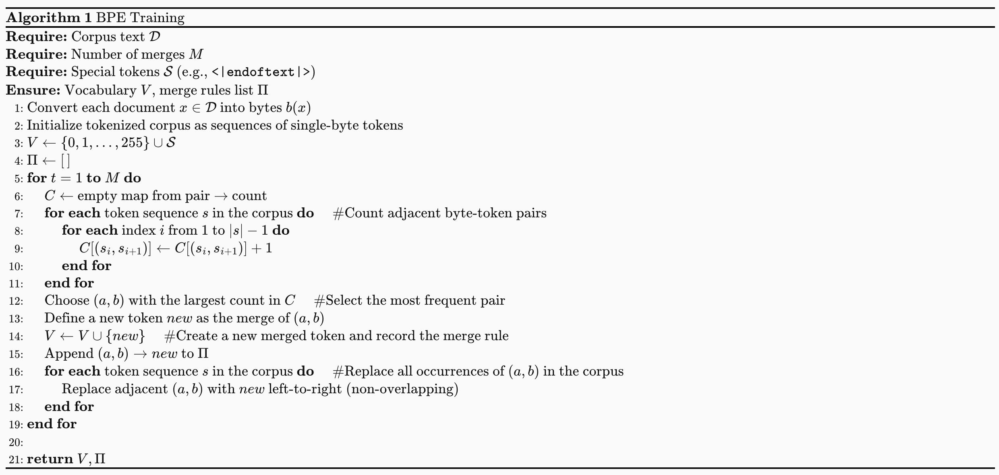

<!--more-->
Assignment 01 要求我们从0实现一个简单的语言模型训练流程，涵盖：

Tokenization 算法的实现
- 模型的定义
- 优化器的定义
- 训练代码

通过这一个Assignment，我们可以了解到创建一个完整的LM模型的全部流程，后续的课程以及Assignment都会基于这个流程进行扩展和优化。


## BPE Tokenizer
回顾一下BPE算法的基本步骤：

1. Initialization: 将输入文本视为字节序列，每个字节作为一个token。初始化词汇表包含所有可能的字节（0-255）。以及Special Tokens，比如 <|endoftext|>
2. Count Pairs: 统计文本中所有相邻字节对的出现频率。
3. Merge Pairs: 将频率最高的字节对其合并为一个新的token，更新文本和词汇表:
  - Get the most frequent pair: 找到出现频率最高的字节对。
  - Add the new pair: 将这个新的字节对加入词汇表。
  - Update the word counter: 更新文本中所有出现该字节对的地方。
  - Update Pairs Counts: 重新统计文本中所有相邻字节对的出现频率。
4. Repeat: 重复步骤2,3，直到达到预定的合并次数

BPE 的伪代码如下所示：

### BPE Version 0

假如我们要Tokenized以下的文本：

string = """ 
low low low low low <|endoftext|>
lower lower widest widest widest <|endoftext|>
newest newest newest newest newest newest 
"""

Step1 要做的就是初始化我们的词汇表：

```python
# 初始化我们的词汇表：
# vocab key: id, value: bytes
def init_vocab(special_tokens: list[str] | None = None) -> dict[int, bytes]:
    """
    这里的 vocab 字典首先填入了 256 个基本单元。这意味着无论输入的文本是什么编码，它最终都能被拆解为字节，从而保证 Tokenizer 永远不会遇到“未知字符”（out-of-vocabulary, OOV）。
    """
    vocab: dict[int, bytes] = {
        x: bytes([x]) for x in range(256)
    }  # idx -> byte representation
    current_index = 256

    if special_tokens is not None:
        for token in special_tokens:
            vocab[current_index] = token.encode("utf-8")
            current_index += 1

    return vocab
```

接下来我们来实现Step2: 统计文本中所有相邻字节对的出现频率。

```python
# 统计文本中所有相邻字节对的出现频率。
# word_counter是整个token序列出现多少次
# Key 是由 ID 组成的元组（表示单词目前的切分状态），Value 是该单词出现的次数。
@deprecated(
    "这个函数在 train_bpe.py 里已经被 merge_pairs_with_heap_index 替代了，因为它效率太低了。"
)
def pair_counts(word_counter: dict[tuple[int, ...], int]) -> dict[tuple[int, int], int]:
    pairs: dict[tuple[int, int], int] = {}
    for word, count in word_counter.items():
        # example: word = (10, 20, 30, 40)
        # list(zip(word, word[1:])) [(10, 20), (20, 30), (30, 40)]
        for a, b in zip(word[:-1], word[1:]):
            pairs[(a, b)] = pairs.get((a, b), 0) + count
    return pairs
```

我们先统计每个词（token 序列）出现的次数 count，再在遍历该词的相邻 token 对时，把每个 pair 的出现次数累加 count，从而得到全语料的 pair 频次。

接下来，我们需要实现 Step3.1: 找到出现频率最高的字节对。在这里，我们遵循的规则是：

1. 频率最高的pair
2. 若多个 pair 频率相同，我们按 pair 的字典序（先比左 token，再比右 token）选择更大的那个。

```python
# 找到出现频率最高的字节对
# 1. 频率最高的pair
# 2. 若多个 pair 频率相同，我们按 pair 的字典序（先比左 token，再比右 token）选择更大的那个。
@deprecated(
    "这个函数在 train_bpe.py 里已经被 pop_most_frequent_pair 替代了,不再遍历字典，而是直接看堆顶。"
)
def get_most_frequent_pair(pair_counter: dict[tuple[int, int], int]) -> tuple[int, int]:
    most_frequent_pair = max(pair_counter.items(), key=lambda item: (item[1], item[0]))
    return most_frequent_pair[0]
```
在这个函数中，我们使用了 Python 内置的 `max` 函数来找到频率最高的 pair。`key=lambda item: (item[1], item[0])` 这个参数告诉 `max` 函数首先比较 pair 的频率（item[1]），如果有多个 pair 频率相同，则比较它们的字典序（item[0]）。这样我们就能按照题目要求正确地选择最频繁的 pair。

most_frequent_pair[0]是本轮要 merge 的 pair（将它替换为一个新 token）

接下来，我们需要实现Step3.2: 将这个新的字节对加入词汇表：
```python
# 将这个新的字节对加入词汇表
def update_vocab(vocab: dict[int, bytes], pair: tuple[int, int]) -> int:
    index1, index2 = pair
    vocab[len(vocab)] = vocab[index1] + vocab[index2]
    return len(vocab) - 1
```

将这个新的pair加入词汇表后，我们需要实现 Step3.3 和 Step3.4: 更新文本中所有出现该字节对的地方，以及重新统计文本中所有相邻字节对的出现频率。 在这里，我们需要遍历所有的word，来看是不是有这个pair出现，若出现了，就将其合并成一个新的token。 同时，我们还需要重新统计所有的pair的频率。

```python


"""
假设我们的语料库里只有一个单词 "abac"，它出现了 10次。
此时，单词被拆解为最小单位（假设 a=1, b=2, c=3）：
word_counter: {(1, 2, 1, 3): 10}
pair_counter: {(1, 2): 10, (2, 1): 10, (1, 3): 10}
函数执行完毕，返回一个元组：
(
    # 第一个字典：告诉主循环，现在的单词长这样了
    {(99, 1, 3): 10},

    # 第二个字典：告诉主循环，下一轮你可以从这两对里选最高频的
    {(99, 1): 10, (1, 3): 10}
)
"""
@deprecated(
    "这个函数在 train_bpe.py 里已经被 build_pair_heap 替代了，因为它效率太低了。"
    "只在开头用一次build_pair_heap：它被改名或合并到了训练开始前的“初始统计”阶段，用来建立第一份 pair 频率堆。"
    "在 merge_pairs_with_heap_index 函数里，它从一个“全量统计函数”变成了“初始统计 + 增量更新”"
)
# 更新文本中所有出现该字节对的地方，以及重新统计文本中所有相邻字节对的出现频率
def merge_pair_ids(
    word_counter: dict[tuple[bytes, ...] | tuple[int, ...], int],
    pair: tuple[int, int],
    new_id: int,
) -> tuple[dict[tuple[int, ...], int], dict[tuple[int, int], int]]:
    new_word_counter: defaultdict[tuple[int, ...], int] = defaultdict(int)
    updated_pair_counter: defaultdict[tuple[int, int], int] = defaultdict(int)
    for token, freq in word_counter.items():
        new_token = []
        i = 0
        L = len(token)
        while i < L:
            if i < L - 1 and (token[i], token[i + 1]) == pair:
                new_token.append(new_id)
                i += 2
            else:
                new_token.append(token[i])
                i += 1
        new_word_counter[tuple(new_token)] += freq

        for index1, index2 in zip(new_token[:-1], new_token[1:]):
            updated_pair_counter[(index1, index2)] += freq

    return dict(new_word_counter), dict(updated_pair_counter)

```

至此，我们已经完成了一轮，重复以上的步骤，直到我们达到目标的轮数，放在一起代码就是：

```python

def train_bpe(
    string: str = string,
    vocab_size: int = 263,
    special_tokens: list[str] = special_tokens,
    save_path: str | None = None,
):
    vocab = init_vocab(special_tokens)
    num_merges = vocab_size - len(vocab)

    merges: dict[tuple[int, int], int] = {}

    word_counter = pre_tokenize(string, special_tokens, including_special=False)

    pairs_freqs = pair_counts(word_counter)

    for _ in range(num_merges):
        most_common_pair = get_most_frequent_pair(pairs_freqs)
        new_index = update_vocab(vocab, most_common_pair)
        merges[most_common_pair] = new_index
        word_counter, pairs_freqs = merge_pair_ids(word_counter, most_common_pair, new_index)
    
    return vocab, merges
```

这也就是我们最简单的BPE的算法，我们称其为BPE Version0。

我们可以看到，尽管这个版本的BPE算法是正确的，但是它的效率非常低，因为每次我们都需要遍历所有的pair，来找到出现频率最高的pair，这样的时间复杂度是$O(N*P)$，其中N是合并的次数，P是pair的数量。如果只是用这种简单的算法，我们是通不过测试的。因此我们需要优化这个算法，不过在优化之前，我们先来了解一下Pre-Processing的步骤。

### Pre-Processing

在实现BPE算法之前，我们需要对文本进行预处理（Pre-Processing），主要包括两个步骤：

1. 根据Special Tokens来分文本
2. 根据正则表达式来分文本

我们先来看一下根据Special Tokens来分文本的情况


我们已经了解过了，在初始化vocab 时，我们也需要初始化special tokens，其中一个常见的special tokens就是 <|endoftext|>. 这个token意味着一段文本的结束。给出一段很长的文本，我们要做的第一件事情就是把这个文本分成许多段，代码的实现如下：


```python


"""
通过把所有 special tokens 先按长度降序排序，
并用正则构造匹配 pattern，我们可以把原始长文本拆成一系列 普通文本片段（以及可选的 special token 片段）。
当 include_special=True 时，
re.split(f"({pattern})", text) 会把匹配到的 special token 也保留下来，从而在后续编码时我们可以把它们当作“原子 token”直接映射到对应的 id；
当 include_special=False 时，
special token 会作为分隔符被丢弃，仅返回普通文本片段，适合训练阶段不想让 special tokens 参与 pair 统计 / merges 的场景。
"""


def split_by_special_tokens(
    text: str, special_tokens: list[str], include_special: bool = False
) -> list[str]:
    if not special_tokens:
        return [text]
    special_tokens_sorted = sorted(special_tokens, key=len, reverse=True)
    pattern = "|".join(re.escape(t) for t in special_tokens_sorted)

    if include_special:
        parts = re.split(f"({pattern})", text)
    else:
        parts = re.split(pattern, text)
    return parts

```


至此，我们就完成了 Special Token-aware 的切分：

1. 通过把所有 special tokens 先按长度降序排序，并用正则构造匹配 pattern，我们可以把原始长文本拆成一系列 普通文本片段（以及可选的 special token 片段）。
2. 当 include_special=True 时，re.split(f"({pattern})", text) 会把匹配到的 special token 也保留下来，从而在后续编码时我们可以把它们当作“原子 token”直接映射到对应的 id；
3. 当 include_special=False 时，special token 会作为分隔符被丢弃，仅返回普通文本片段，适合训练阶段不想让 special tokens 参与 pair 统计 / merges 的场景。

接下来，我们就可以对每个普通片段执行Regular-based的切分了，在这个过程中，我们会把文本切成更小的片段，比如词、子词片段、标点分隔片段等。


Pre-Tokenization（预分词） 就是在真正训练 BPE 合并规则之前，先对整份语料做一次粗粒度的切分，把文本切成一段段“更大的片段”（pre-token），然后在这些片段内部去统计相邻字节（byte pair）的出现频率。、 那么，为什么需要Pre-Tokenization呢，主要有两个原因：

**原因一**：避免“每合并一次就全语料扫一遍”
我们知道，merge一次，我们就要重新扫描一次，以获得更新后的新语料，如果这个语料特别大，或者我们merge的次数特别多，那么就会导致我们算法特别的慢。
这个时候我们就需要Pre-Tokenization，它的作用是：

先把语料切成很多“pre-token”（比如词、子词片段、标点分隔片段等）
统计时不再对整个语料逐字符/逐字节扫描，而是利用重复出现的 pre-token 的次数来加速。
举个例子：

‘text’ 这个 pre-token 出现了 10 次
当我们要统计 ‘t’ 和 ‘e’ 相邻出现次数
只要在 ‘text’ 里看到一次 “t”+“e” 相邻，就可以一次性把计数加 10 而不是把语料里每个 ‘text’ 都逐字节再看一遍。


**原因二**：避免学出“只有标点不同”的重复 token
比如有两个词 dog! 和 dog. 如果我们那不Pre-tokenization，那么这个很容易被当成不同的序列，从而对于这个类似的词，有两个完全不同的IDs。而 Pre-tokenization 通常会用一些规则（比如按空白、标点边界等）先切开，让 BPE 更多在“词内部”学习合并规律，而不是把词和各种标点粘在一起乱合并。

在这个 Assignment 里，我们采用 regex-based pre-tokenizer（GPT-2 使用的那条正则），先把原始文本切成一串“预分词片段”（pre-tokens），再对每个片段做 byte-level BPE。

```python
PAT = r"""'(?:[sdmt]|ll|ve|re)| ?\p{L}+| ?\p{N}+| ?[^\s\p{L}\p{N}]+|\s+(?!\S)|\s+"""
```

有了这个正则表达式，我们就可以实现 Pre-Tokenization 了，代码如下：

```python

def pre_tokenize(
    string: str,
    special_tokens: list[str] | None = None,
    including_special: bool = False,
) -> Counter:
    word_counter = Counter()
    chunks = split_by_special_tokens(
        string, special_tokens, include_special=including_special
    )
    for chunk in chunks:
        if not chunk:
            continue
        if including_special and chunk in special_tokens:
            word_counter[tuple(string_to_bytes(chunk))] += 1
        else:
            for match in re.finditer(PAT, chunk):
                token = match.group(0)
                token_ids = tuple(string_to_bytes(token, return_int=True))
                word_counter[token_ids] += 1
    return word_counter
```

通过 pre-tokenization，我们把原始文本转换成许多“预分词片段”的 byte/id 序列，并用 Counter 统计每种片段出现的次数。后续在统计 pair 频率时，每个片段的相邻 token 对出现次数都会按其 count 加权累加，从而得到全语料的 pair 频次。

以上这两步（Special Token-aware Splitting 和 Regex-based Pre-Tokenization），我们可以通过一个 Multi-Processing


Python 的MultiProcessing 是一个- 多进程 更适合 CPU 密集型任务（比如预分词、统计）。，我们只需要了解以下的内容：

```python

from multiprocessing import Process, Queue  
import queue  
from collections import Counter 

def task(*args):  # 定义实际要并行执行的任务函数
    # ... do something ...  # 这里写你的真实任务逻辑
    return Counter()  # 返回一个 Counter（示例），便于主进程聚合

def task_worker(out_queue: Queue, *args):  # worker：接收输出队列和任务参数

    output = task(*args)  # 执行任务，得到部分结果
    
    out_queue.put(output)  # 把结果放进队列，交给主进程汇总

num_process = 4  # 进程数示例（你需要自己设置）
task_args_list = [("a",), ("b",), ("c",), ("d",)]  # 每个进程的参数示例（你需要替换成真实参数）

out_queue: Queue = manager.Queue() # 创建进程间通信队列
processes: list[Process] = []  # 保存所有进程对象，方便后面 join

for args in task_args_list:  # 遍历每个任务的参数
    p = Process(target=task_worker, args=(out_queue, *args))  # 创建进程，并把队列+参数传给 worker
    processes.append(p)  # 记录进程对象
    p.start()  # 启动进程开始执行

all_out = Counter()  # 主进程的总 Counter，用于累加所有部分结果

for _ in range(len(processes)):  # 预期每个进程都会 put 一次结果，所以收 len(processes) 次
    try:
        partial_out = out_queue.get(timeout=10)  # 从队列取一个结果，最多等待 10 秒
        all_out.update(partial_out)  # 把这个进程的 Counter 合并到总 Counter
    except queue.Empty:  # 如果超时没取到，就跳过
        continue  # 继续尝试下一个

for p in processes:  # 遍历所有进程
    p.join()  # 等待进程结束

```

有了这些前置知识之后，实现这个Pre-Processing的步骤就很容易了，以下是Pre-process的代码

```python

"""
如果没有这段代码，BPE 的 pre_tokenize 阶段会成为瓶颈：

单进程：读取 1GB 文件 -> 分词 -> 统计（耗时 10 分钟）。

多进程 (8核)：文件切 8 份 -> 8 个核心同时分词 -> 汇总（耗时约 1.5 分钟）。

这段代码通过文件指针定位 (seek) 和 进程间通信 (Queue)，
实现了对海量文本的高效预处理，为后续的 BPE 迭代打下了坚实的性能基础。
"""


def pre_tokenize_string_worker(*args):
    input_path, special_tokens, queue, start, end, include_special = args
    with open(input_path, "rb") as f:
        f.seek(start)
        chunk = f.read(end - start).decode("utf-8", errors="ignore")
    word_counter = pre_tokenize(
        chunk, special_tokens, including_special=include_special
    )
    queue.put(word_counter)

```

通过这个合集，我们的得到了 word_counter 这个变量. 它记录了每个 pre-token（byte/id 序列）在整个语料中出现的次数，接下来我们就可以基于这个 word_counter 来统计 pair 频次，并进行 BPE 合并了.

除了 word_counter（记录每个 word/token 序列出现次数）之外，我们还会额外构建两个辅助结构，来支持后续 更高效的 pair 统计与更新：

```python

pairs_counter = Counter()
pair_to_words: dict[tuple[int, int], set[tuple[int, ...]]] = defaultdict(set)
for word in word_counter:
    for i in range(len(word) - 1):
        pair = (word[i], word[i + 1])
        pair_to_words[pair].add(word)
        pairs_counter[pair] += word_counter[word]
```


- **pairs_counter**[pair]：**BPE Version 1的pop_most_frequent_pair函数延迟更新校验的时候用**。记录该相邻 pair 在全语料中的总出现次数。 因为每个 word 在语料中出现了 word_counter[word] 次，所以 word 内部每出现一次 pair，就为全局频次贡献 word_counter[word]。
- **pair_to_words**[pair]：**BPE Version 2的merge_pairs_with_heap_index函数用，新单词会产生新的 pair，旧单词会失效一些旧 pair**。记录该 pair 出现在哪些 word（token 序列）里, 这个映射非常关键：当我们选择某个 pair 进行 merge 时，只有包含该 pair 的 word 会发生变化。借助 pair_to_words，我们可以只遍历这些“受影响的 words”，并对 pairs_counter 做局部增量更新，而不是每轮都重新扫描全部 word_counter。


### BPE Version 1： 用堆优化“找最频繁 pair”的步骤


一个很明显的优化点是：每一轮都要找当前频率最高的 pair。我们每轮都通过遍历 pairs_counter 来取最大值，这一步是
（O(n),n是 pair 的数量）。而这个操作正好符合堆（heap）的使用场景：用堆维护“当前最大的元素”，就能把“取最大”降到
O(1)。
具体做法是把每个 pair 作为堆元素，并把“排序依据”设计成：

- 频次越大优先级越高
- 频次相同则按 pair 的字典序更大者优先
在 Python 的 heapq 是最小堆，因此我们可以用负号把它变成“最大堆”，例如存成：

key = (-freq, a, b)

常见最大堆写法

```python

import heapq

data = [1, 3, 5, 7, 9, 2, 4, 6, 8, 0]
# 1. 列表取负数
max_heap = [-x for x in data]
# 2. 堆化
heapq.heapify(max_heap)

# 3. 压入新元素（注意取负）
new_val = 10
heapq.heappush(max_heap, -new_val)

# 4. 弹出最大值（注意弹出后还原）
largest = -heapq.heappop(max_heap)
print(largest)  # 输出: 10
```

这样每一轮我们都能快速拿到候选的“最常见 pair”。

```python

class HeapItem:
    def __init__(
        self, neg_freq: int, pair_bytes: tuple[bytes, bytes], pair: tuple[int, int]
    ):
        """
        把频率取负数。比如频率 100 变成 -100，频率 50 变成 -50。在小顶堆里，-100 比 -50 小，所以 100 会先被弹出。
        """
        self.neg_freq = neg_freq
        self.pair_bytes = pair_bytes
        self.pair = pair

    def __lt__(self, other: "HeapItem") -> bool:
        if self.neg_freq != other.neg_freq:
            return self.neg_freq < other.neg_freq # 频率越高（负值越小），优先级越高
        return self.pair_bytes > other.pair_bytes  # 频率相同时，字节序大的优先


def build_pair_heap(pairs_freqs: Counter, vocab: dict[int, bytes]):
    heap = []
    for (a, b), f in pairs_freqs.items():
        if f > 0:
            item = HeapItem(-f, (vocab[a], vocab[b]), (a, b))
            heapq.heappush(heap, item)
    return heap


"""
核心思路：延迟更新 (Lazy Update)
堆优化的核心难点在于：当两个 ID 合并时，周围相邻 pair 的频率会发生变化，但我们不能立即去堆里修改它们（因为在 Python 的 heapq 中修改中间元素非常慢）。
解决办法：

不管它：频率变了就让它在堆里待着。

校验：每次从堆顶弹出（Pop）最强 pair 时，检查一下它的频率是否和当前 pairs_counter 里的真实频率一致。如果不一致，说明这个数据“过期”了，直接扔掉，看下一个。
"""
def pop_most_frequent_pair(heap, pairs_counter: Counter) -> tuple[int, int]:
    while heap:
        item = heap[0]  # Peek at the top item
        neg_f = item.neg_freq
        pair = item.pair
        # 真实的次数
        cur_f = pairs_counter.get(pair, 0)
        # 堆顶元素的次数是负数，所以取反得到真实频率
        if (
            cur_f <= 0 or -neg_f != cur_f
        ):  # frequency changed, which means the pair we store in heap is stale
            heapq.heappop(heap)
            continue
        return pair

    raise ValueError("No positive-frequency pairs remain")
```
场景： 假设堆里有一个 pair (a, b) 频率是 10。现在我们在语料库中合并了另一对 (x, y)，而这一操作导致 (a, b) 的实际频率变成了 8。

问题： 在 Python 的 heapq 中，找到并修改堆中间的某个元素是非常昂贵的（$O(N)$）。

解决方案（此代码的做法）：

- 不修改：让那个旧的 (a, b, freq=10) 留在堆里。

- 新插入：如果频率变了，直接 heappush 一个新的 (a, b, freq=8) 进去。

- 校验 (Validation)：

    - 当 pop_most_frequent_pair 弹出元素时，检查 if -neg_f != cur_f。

    - 如果堆里记录的频率（10）和 pairs_counter （全局维护的变量）里真实的频率（8）对不上，说明这是个“过时的残留物”，直接丢弃。

### BPE Version 2： 增量更新“受影响 pair”的频率

我们每一轮都会遍历 word_counter 里的所有 word，检查这个 word 里是否出现了目标 pair；这一步的代价通常非常高，因为绝大多数 word 根本不包含 当前要 merge 的 pair，但我们还是把它们都扫了一遍。

因此我们可以用一个“倒排索引”来做 空间换时间：提前维护一个映射 pair -> {words…}，记录每个 pair 出现在哪些 word 中。这样当我们决定 merge 某个 pair 时，就只需要遍历 pair_to_words[pair] 里的那一小部分 word，而不必全量扫描所有 word。

这也正是我们搭建 pair_to_words 的原因：

没有索引：每轮 merge 都是 全量扫描所有 words（慢，O(N)级别）。
有索引：每轮只处理 包含该 pair 的 words 子集（快，复杂度取决于该 pair 的覆盖范围，通常远小于全量）。
接下来，我们还需要在 merge 之后，更新这个索引：当某个 pair 被 merge 成一个新 token 后，所有包含该 pair 的 word 都会发生变化，因此我们需要把这些 word 从旧 pair 的索引里移除，并把它们添加到新 pair 的索引里。具体实现如下：

```python

def merge_pairs_with_heap_index(
    word_counter: dict[tuple[int, ...], int],
    pair_counter: Counter,
    target_pair: tuple[int, int],
    new_id: int,
    vocab: dict[int, bytes],
    pair_heap,
    pair_to_words: dict[tuple[int, int], set[tuple[int, ...]]],
) -> tuple[
    dict[tuple[int, ...], int],
    Counter,
    list,
    dict[tuple[int, int], set[tuple[int, ...]]],
]:
    # 保留未受影响单词计数；仅对受影响单词做“替换”
    new_word_counter: Counter = Counter(word_counter)
    updated_pair_counter: Counter = pair_counter.copy()
    changed_pairs: set[tuple[int, int]] = set()

    affected_words = list(pair_to_words.get(target_pair, set()))

    # 更新 pair_to_words 索引：新单词会产生新的 pair，旧单词会失效一些旧 pair
    for w in affected_words:
        freq = word_counter.get(w, 0)
        if freq <= 0 or len(w) < 2:
            continue
        # 1. 从词典计数中扣除旧单词的频率
        new_word_counter[w] -= freq
        if new_word_counter.get(w, 0) <= 0:
            del new_word_counter[w]
        # 2. 关键：清理旧邻居的频率
        """
        为什么要扣除所有相邻对？ 因为只要单词 w 发生了合并，
        它内部所有的相邻关系都会断开或重组。为了保证计数准确，必须先“归零”旧的贡献。
        """
        for i in range(len(w) - 1):
            pair = (w[i], w[i + 1])
            # 这些相邻对即将消失或改变
            updated_pair_counter[pair] -= freq
            # 标记这些 pair 需要重新入堆
            changed_pairs.add(pair)
            # 在索引里删掉旧单词
            s = pair_to_words.get(pair)
            if s is not None:
                s.discard(w)
                if not s:
                    del pair_to_words[pair]
        # 3. 构造新单词，并加入词典计数
        new_word = get_new_word(w, target_pair, new_id)
        new_word_counter[new_word] += freq

        # 4. 更新新单词的相邻对频率，并更新索引
        if len(new_word) < 2:
            continue
        for i in range(len(new_word) - 1):
            pair = (new_word[i], new_word[i + 1])
            updated_pair_counter[pair] += freq
            changed_pairs.add(pair)
            pair_to_words.setdefault(pair, set()).add(new_word)

    # 5. 把受影响的 pair 重新入堆
    if pair_heap is not None:
        for pair in changed_pairs:
            f = updated_pair_counter.get(pair, 0)
            if f > 0:
                """
                这里并没有去堆里寻找并删除旧数据（因为那太慢了），
                而是直接把最新的频率作为新任务 heappush 进去。
                这会导致堆里存在多个相同的 pair，但频率不同。
                但是堆自己会在pop_most_frequent_pair函数校验
                """
                heapq.heappush(
                    pair_heap, HeapItem(-f, (vocab[pair[0]], vocab[pair[1]]), pair)
                )
    return dict(new_word_counter), updated_pair_counter, pair_heap, pair_to_words

```

### Train BPE

将上面的实现，替换成我们最新的实现后，我们就可以实现BPE的算法：

```python
def train_bpe(
    input_path: str | os.PathLike,
    vocab_size: int,
    special_tokens: list[str] | None = None,
    verbose: bool = False,
    **kwargs,
) -> tuple[dict[int, bytes], list[tuple[bytes, bytes]]]:
    """
    计算合并次数：BPE 每次合并产生一个新 Token。
    目标词表大小减去初始的 256 个字节和特殊字符，就是我们需要执行循环的次数。
    初始状态：vocab 此时只包含最基础的单位（0-255）和特殊符号。
    """
    num_merges = vocab_size - 256 - (len(special_tokens) if special_tokens else 0)
    vocab: dict[int, bytes] = init_vocab(special_tokens)
    merges: list[tuple[bytes, bytes]] = []

    # 1. Pre-tokenization
    # 1.1 Find chunk boundaries
    # 切分文件
    with open(input_path, "rb") as f:
        chunk_boundaries = find_chunk_boundaries(
            f,
            desired_num_chunks=kwargs.get("desired_num_chunks", NUM_PROCESSES),
            split_special_token=b"\n",
        )

    if verbose:
        print_color(
            f"Identified {len(chunk_boundaries) - 1} chunks for pre-tokenization."
        )
    # 多进程并行
    # 1.2 Count word frequencies across chunks using multiprocessing
    manager = Manager()
    queue = manager.Queue()
    processes: list[Process] = []

    for start, end in zip(chunk_boundaries[:-1], chunk_boundaries[1:]):
        p = Process(
            target=pre_tokenize_string_worker,
            args=(input_path, special_tokens, queue, start, end, False),
        )
        processes.append(p)
        p.start()

    if verbose:
        print_color("Pre-tokenization processes completed. Aggregating results...")

    # 等待所有子进程结束，然后再收集词频，避免在长语料下超时导致结果丢失
    for p in processes:
        p.join()
        if p.exitcode is not None and p.exitcode != 0:
            raise RuntimeError(
                f"Pre-tokenization process failed with exit code {p.exitcode}."
            )

    word_counter = Counter()
    while True:
        try:
            partial_counter = queue.get(timeout=1)
            # 主进程使用 word_counter.update 将所有人的结果加在一起。
            # 结果：此时我们得到了语料库中所有词（以字节元组形式）出现的频率
            word_counter.update(partial_counter)
        except Empty:
            break

    if verbose:
        print_color(
            f"Completed pre-tokenization. Vocabulary size: {len(word_counter)} unique tokens."
        )

    """
    pairs_counter[pair]：记录该相邻 pair 在全语料中的总出现次数。 因为每个 word 在语料中出现了 word_counter[word] 次，所以 word 内部每出现一次 pair，就为全局频次贡献 word_counter[word]。
    pair_to_words[pair]：记录该 pair 出现在哪些 word（token 序列）里, 这个映射非常关键：当我们选择某个 pair 进行 merge 时，只有包含该 pair 的 word 会发生变化。
    借助 pair_to_words，我们可以只遍历这些“受影响的 words”，并对 pairs_counter 做局部增量更新，而不是每轮都重新扫描全部 word_counter。
     """
    pairs_counter = Counter()
    pair_to_words: dict[tuple[int, int], set[tuple[int, ...]]] = defaultdict(set)
    for word in word_counter:
        for i in range(len(word) - 1):
            pair = (word[i], word[i + 1])
            pair_to_words[pair].add(word)
            pairs_counter[pair] += word_counter[word]

    # 2. BPE Core Loop
    # 建立最大堆
    pair_heap = build_pair_heap(pairs_counter, vocab)

    for i in trange(num_merges):
        # 获取当前最强组合
        most_frequent_pair = pop_most_frequent_pair(pair_heap, pairs_counter)
        # 更新词表并获取新 ID
        new_id = update_vocab(vocab, most_frequent_pair)
        # 局部精准合并（这是最核心的性能优化点）
        word_counter, pairs_counter, pair_heap, pair_to_words = (
            merge_pairs_with_heap_index(
                word_counter,
                pairs_counter,
                most_frequent_pair,
                new_id,
                vocab,
                pair_heap,
                pair_to_words,
            )
        )
        # 记录合并规则
        merges.append((vocab[most_frequent_pair[0]], vocab[most_frequent_pair[1]]))
    # 将训练好的 vocab 和 merges 存入磁盘。
    # 这样在之后的分词阶段（Inference），你可以直接加载它们，而不需要重新训练。
    if kwargs.get("save_path"):
        save_vocab_and_merges(vocab, merges, kwargs["save_path"])
        with open(
            os.path.join(kwargs["save_path"], "special_tokens.txt"),
            "w",
            encoding="utf-8",
        ) as f:
            if special_tokens:
                for token in special_tokens:
                    f.write(f"{token}\n")

    return vocab, merges
```

### BPE Tokenizer

有了vocab merges 我们可以实现一个BPE Tokenizer

```python
class BPETokenizer:
    def __init__(
        self,
        vocab: dict[int, bytes],
        merges: list[tuple[bytes, bytes]],
        special_tokens: list[str] | None = None,
    ):
        self.vocab = vocab
        self.merges = merges
        self.special_tokens = special_tokens if special_tokens else []
        self.special_tokens_bytes = [t.encode("utf-8") for t in self.special_tokens]
        self.special_set = set(self.special_tokens_bytes)

        self.vocab_inv = {v: k for k, v in self.vocab.items()}

        # 记录合并的优先级。在 merges 列表里越靠前（r 越小），优先级越高。
        # 比如遇到 h e l l o，如果 h e 排第 1，l l 排第 5，那就必须先合并 h e。
        rank: dict[tuple[int, int], int] = {}
        # 速查表。直接记录 (ID_h, ID_e) -> ID_he。有了它，合并时瞬间就能拿到新 ID。
        merge_to_new_id: dict[tuple[int, int], int] = {}

        for r, (a_bytes, b_bytes) in enumerate(self.merges):
            a_id = self.vocab_inv.get(a_bytes)
            b_id = self.vocab_inv.get(b_bytes)
            # The merged token should be present in vocab; if not, skip this merge rule.
            new_id = self.vocab_inv.get(a_bytes + b_bytes)
            if a_id is None or b_id is None or new_id is None:
                continue
            pair = (a_id, b_id)
            rank[pair] = r
            merge_to_new_id[pair] = new_id

        self.rank = rank
        self.merge_to_new_id = merge_to_new_id

        self.eos_token_id = self.vocab_inv.get(b"<|endoftext|>", None)

    """
    当拿到一句长长的文本，比如 "Hello world! <|endoftext|>"，不能直接把它全拆成单字母。

    保护特殊符号：把 <|endoftext|> 这种单独拎出来，它不参与合并。

    正则切分（PAT）：把 "Hello world!" 切成 "Hello", " ", "world", "!"。

    转成 Bytes：最后把每个碎片转成 utf-8 字节。
    """

    def _pre_tokenize(self, text: str) -> list[bytes]:
        parts = split_by_special_tokens(text, self.special_tokens, include_special=True)
        token_list: list[bytes] = []

        for part in parts:
            if part == "":
                continue
            if part in self.special_tokens:
                token_list.append(part.encode("utf-8"))
            else:
                for tok in re.findall(PAT, part):
                    # Each regex token becomes a single bytestring.
                    token_list.append(tok.encode("utf-8"))

        return token_list

    """
    如果用普通的数组来合并，每次把两个元素变成一个元素，数组后面的所有元素都要往前挪一位。如果句子很长，这种操作会慢得让人崩溃。
    这段代码使用了一个高级数据结构组合：双向链表 (Doubly-Linked List) + 优先队列/堆 (Heap)。
    """

    def encode(self, text: str) -> list[int]:
        def merge_one_pretoken(ids: list[int]) -> list[int]:
            n = len(ids)
            if n <= 1:
                return ids

            """
            合并时并不真的 del 掉元素，而是：
            标记被吞掉的节点 alive[j] = False
            调整指针 nxt[i] = nxt[j]、prev[nxt[j]] = i
            这样就能在 O(1) 时间内完成合并，而不需要移动后续元素。
            """
            alive = [True] * n

            # Doubly-linked list over positions 0..n-1 (positions are stable; nodes get "deleted")
            prev = [-1] * n
            nxt = [-1] * n
            for i in range(n):
                prev[i] = i - 1
                nxt[i] = i + 1 if i + 1 < n else -1
            """
            堆里存 (rank, i)，
            表示当前位置 i 与其右邻居 nxt[i] 的 pair 在 merge 规则中的优先级（rank 越小越先合并）。
            每次取出最小 rank 的候选，做一次合并，然后只需要重新检查局部的两个 pair：

            (prev[i], i)
            (i, nxt[i])

            """
            # best pair per left-position i: (rank, i)
            heap: list[tuple[int, int]] = []

            def push_if_valid(i: int):
                cur_r = None
                j = nxt[i]
                if j == -1 or not alive[i] or not alive[j]:
                    cur_r = None
                else:
                    cur_r = self.rank.get((ids[i], ids[j]))

                if cur_r is not None:
                    heapq.heappush(heap, (cur_r, i))

            for i in range(n):
                push_if_valid(i)
            """

            与之前的heap一样，heap里面的内容会 “过期”：
            因为合并会改变邻接关系，堆中旧条目会过期，所以每次 pop 出来都要验证,

            接下来就是遍历这个heap，
            如果这个heap不是空的，我们就弹出，并且验证：

            这段 while heap: 是整个 merge_one_pretoken 的核心：
            堆里维护“当前可合并的相邻 pair”，
            每次取出 rank 最小（最优先） 的候选进行合并，并只更新合并点附近的候选。
            """
            while heap:  # 只要还有候选 pair，就继续尝试合并
                r, i = heapq.heappop(
                    heap
                )  # 取出当前 rank 最小的候选：(rank, 左端点位置 i)
                j = nxt[i]  # 右端点位置 j 是 i 在链表中的后继
                if (
                    j == -1 or not alive[i] or not alive[j]
                ):  # i/j 无效或 i 已到尾部：这是过期候选
                    continue
                # stale check：堆里的记录可能已过期（邻居关系/ids 已改变），需要重新验证
                # 注意后面合并后nxt[i]会变，所以每次都要检查当前 i 和 j 的 pair 是否仍然匹配当前 rank
                pair = (ids[i], ids[j])
                cur_r = self.rank.get(
                    pair
                )  # 查询这个 pair 在 merge 规则中的 rank（不可合并则为 None）
                if (
                    cur_r is None or cur_r != r
                ):  # 现在不可合并，或 rank 已不匹配：说明堆元素过期
                    continue

                # 执行合并：把 (ids[i], ids[j]) 合成一个新 token，并写回到位置 i
                new_id = self.merge_to_new_id.get(pair)
                if new_id is None:
                    continue
                ids[i] = new_id

                # 从链表中删除 j：j 被 i 吞掉了
                alive[j] = False
                nj = nxt[j]
                nxt[i] = nj
                if nj != -1:
                    prev[nj] = i

                # 局部更新：合并只会影响 i 附近的两个相邻 pair
                pi = prev[i]
                if pi != -1:
                    push_if_valid(pi)  # (pi, i) 这个 pair 可能变得可合并或 rank 改变
                push_if_valid(i)  # (i, nxt[i]) 这个 pair 也可能变得可合并或 rank 改变

            # 最终合并后的 token id 序列
            out: list[int] = []
            k = 0
            while k != -1:
                if alive[k]:
                    out.append(ids[k])
                k = nxt[k]
            return out

        byte_tokens = self._pre_tokenize(text)

        """
        Pre-tokenization：先粗粒度切分文本
        对每个切分出来的 pre-token 做 BPE merge (merge_one_pretoken)，得到最终的 token ID 序列。
        """
        token_ids: list[int] = []
        for btok in byte_tokens:
            if btok in self.special_set:
                token_ids.append(self.vocab_inv[btok])
            else:
                ids = [self.vocab_inv[bytes([b])] for b in btok]
                token_ids.extend(merge_one_pretoken(ids))

        return token_ids

    def encode_iterable(self, iterable: Iterable[str]) -> Iterator[int]:
        # Placeholder for iterable encoding logic
        for text in iterable:
            yield from self.encode(text)

    def decode(self, ids: list[int]) -> str:
        # https://en.wikipedia.org/wiki/Specials_(Unicode_block)#Replacement_character

        tokens = b"".join(self.vocab.get(i, b"\xef\xbf\xbd") for i in ids)
        return tokens.decode("utf-8", errors="replace")

    @classmethod
    def from_files(
        cls,
        vocab_filepath: str,
        merges_filepath: str,
        special_tokens: list[str] | str | None = None,
    ) -> "BPETokenizer":
        with open(vocab_filepath) as vf:
            vocab_data = json.load(vf)
            vocab = {int(i): bytes(v, "latin1") for v, i in vocab_data.items()}

        merges = []
        with open(merges_filepath) as mf:
            # Skip the first line (header)
            next(mf)
            for line in mf:
                if line.strip() and not line.startswith("#"):
                    parts = line.strip().split()
                    if len(parts) == 2:
                        merges.append(
                            (bytes(parts[0], "latin1"), bytes(parts[1], "latin1"))
                        )

        if isinstance(special_tokens, str):
            with open(special_tokens, encoding="utf-8") as stf:
                special_tokens_list = [line.strip() for line in stf if line.strip()]
        elif isinstance(special_tokens, list):
            special_tokens_list = special_tokens
        else:
            special_tokens_list = []

        return cls(vocab, merges, special_tokens_list)
```

BPE Tokenizer 主要实现三个功能：

1. encode：把字符串编码成 token IDs 列表
2. encode_iterable：把字符串编码成 token IDs 生成器
3. decode：把 token IDs 列表解码成字符串

这个encode主要做两个事情：

1. Pre-tokenization：先粗粒度切分文本
2. 对每个 pre-token 做 BPE merge


第一步和我们之前实现的一样，对于第二步，主要的实现方法在 merge_one_pretoken 中实现。 
在这个函数中，我们通过Heap和Double Linked List 来高效实现这个Encode。如果用普通的 list 进行合并，每次删除两个元素插入一个新元素，时间复杂度是 $O(N^2)$。这段代码利用“双向链表 + 延迟更新堆”将复杂度降到了 $O(N \log N)$。

首先，我们用数组来模拟双向链表：

```python
prev = [-1] * n
nxt  = [-1] * n
alive = [True] * n
```


合并时并不真的 del 掉元素，而是：

- 标记被吞掉的节点 `alive[j] = False`
- 调整指针 `nxt[i] = nxt[j]`、`prev[nxt[j]] = i`
这样每次合并都是 $O(1)$ 的时间复杂度。


**为什么用双向链表？**
1. 在数组中删除元素要移动后面所有的元素。
2. 在双向链表中，合并 ids[i] 和 ids[j] 只需要：
   1. 把 ids[i] 的值改掉。
   2. 让 nxt[i] 指向 j 的下一个节点。
   3. 标记 j 为 alive = False。
   4. 结果：所有位置的索引（index）在内存中保持不动，合并操作变成 $O(1)$。

**堆与优先级**

堆与优先级代码维护了一个堆，里面存的是 (priority_rank, position_i)。
1. 语义：位置 i 和它右边的邻居 nxt[i] 组成的这对 Pair，其合并优先级是多少？
2. 每次从堆顶弹出 rank 最小（即最优先）的一对进行合并。

**延迟更新 (Stale Check)**
当你合并了位置 i 和 j：位置 i 左右两边的邻居关系都变了。

原来在堆里的 (prev[i], i) 的优先级可能变了，(i, nxt[j]) 的优先级也变了。

- 策略：代码并不去堆里“寻找并删除”旧的记录（太慢），而是直接把新的优先级对 push 进堆。
- 校验：当从堆中弹出元素时，通过 if cur_r is None or cur_r != r 
- 检查：如果当前这一对的真实优先级和堆里存的不一样，说明这是个“过时”的记录，直接丢弃。

接下来就是遍历这个heap，如果这个heap不是空的，我们就弹出，并且验证：

这段 while heap: 是整个 merge_one_pretoken 的核心：堆里维护“当前可合并的相邻 pair”，每次取出 rank 最小（最优先） 的候选进行合并，并只更新合并点附近的候选。

最后我们只需要把链表结构还原成最终的token序列即可：

在 BPE 合并阶段，我们用 prev / nxt / alive 维护了一个“数组模拟的双向链表”。合并时并不会真的删除 ids 里的元素，而是把被吞掉的位置标记为 alive=False，并通过 nxt 跳过它们。
因此在所有合并完成后，需要把“还活着的节点”按顺序重新收集成一个紧凑的输出序列：

### Tokenize and Save File

有了 tokenizer.encode() 之后，我们通常会希望把一整个文本文件编码成 紧凑的二进制（.bin），方便后续训练时用 np.memmap 之类的方式高效加载，而不是每次都重新分词。

下面这段函数做的事情很简单：按行读取文本 → 把每行编码成 token ids → 用固定 dtype 写入二进制文件。

```python
def encode_file_to_bin(tokenizer, text_path, out_bin_path, dtype=np.uint16):
    total_bytes = os.path.getsize(text_path)

    with open(text_path, encoding="utf-8") as f_in, open(out_bin_path, "wb") as f_out:
        p_bar = tqdm(total=total_bytes, desc="Encoding to binary", unit="B", unit_scale=True)

        for line in f_in:
            token_ids = tokenizer.encode(line)          # 1) 把一行文本编码成 token ids
            arr = np.array(token_ids, dtype=dtype)      # 2) 转成 numpy 数组（更适合写二进制）
            arr.tofile(f_out)                           # 3) 直接以二进制写入 .bin 文件

            p_bar.update(len(line.encode("utf-8")))     

```

### 总结

#### 核心目标
从零实现 BPE Tokenizer，完成文本 → Token IDs 的完整流程。

---

#### 一、算法流程（BPE 三版迭代）

**Version 0（基础版）**：初始化 256 字节词表 → 统计相邻字节对频率 → 反复合并最高频 pair，直到达到目标词表大小。正确但慢，每轮全量遍历所有 pair，复杂度 $O(N \times P)$。

**Version 1（堆优化）**：用最大堆维护 pair 频率，"取最频繁 pair" 从 $O(P)$ 降到 $O(1)$。核心技巧：**延迟更新**——pair 频率变化时不修改堆，而是直接 push 新记录，pop 时校验是否过期。

**Version 2（倒排索引）**：额外维护 `pair_to_words` 映射，记录每个 pair 出现在哪些词中。merge 时只遍历受影响的词，做**增量更新**，避免每轮全量扫描。

---

#### 二、Pre-Processing

训练前需两步切分：

1. **Special Token 切分**：按 `<|endoftext|>` 等特殊符号先分段，special token 不参与 pair 统计。
2. **正则预分词**（GPT-2 PAT）：将普通文本切成词/子词/标点片段（pre-token），统计时对同一片段的所有出现次数一次性累加，大幅提速。

两步合并后得到 `word_counter`（pre-token 字节序列 → 出现次数），以及 `pairs_counter`、`pair_to_words` 两个辅助结构。**多进程并行**处理大文件，按块分配，子进程结果通过 Queue 汇总。

---

#### 三、BPE Tokenizer（Encode/Decode）

**encode** 的两步：
1. 预分词（同训练阶段）
2. 对每个 pre-token 执行 BPE merge（`merge_one_pretoken`）

`merge_one_pretoken` 用**数组模拟双向链表 + 延迟更新堆**实现，将朴素 $O(N^2)$ 降至 $O(N \log N)$：
- 链表：合并时只改指针和 `alive` 标记，不移动数组元素，单次合并 $O(1)$
- 堆：按 merge rank 排序候选 pair，pop 时做 stale check 校验是否过期

**decode**：直接将 token ID 序列拼接对应字节，UTF-8 解码输出。

---

#### 四、训练结果保存

训练完成后将 `vocab` 和 `merges` 序列化到磁盘；推理时直接加载，无需重新训练。文本文件可通过 `encode_file_to_bin` 编码为紧凑二进制（`.bin`），便于训练时用 `np.memmap` 高效读取。