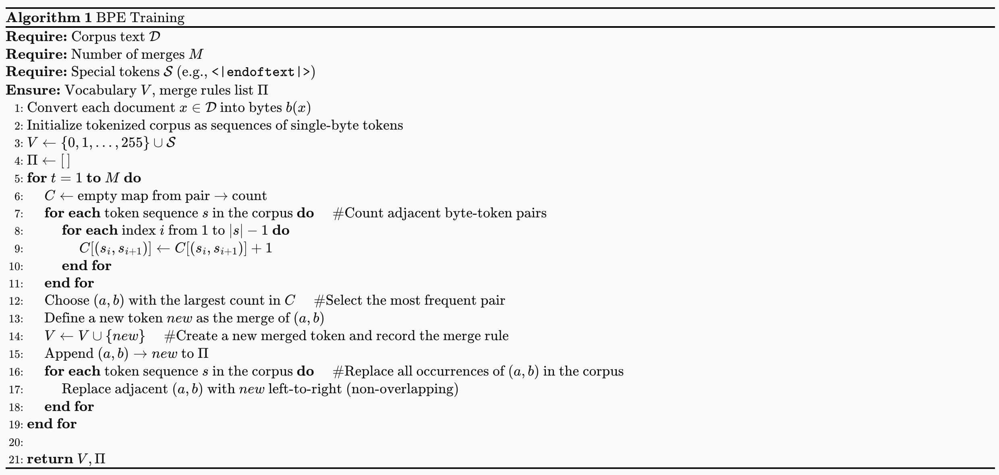
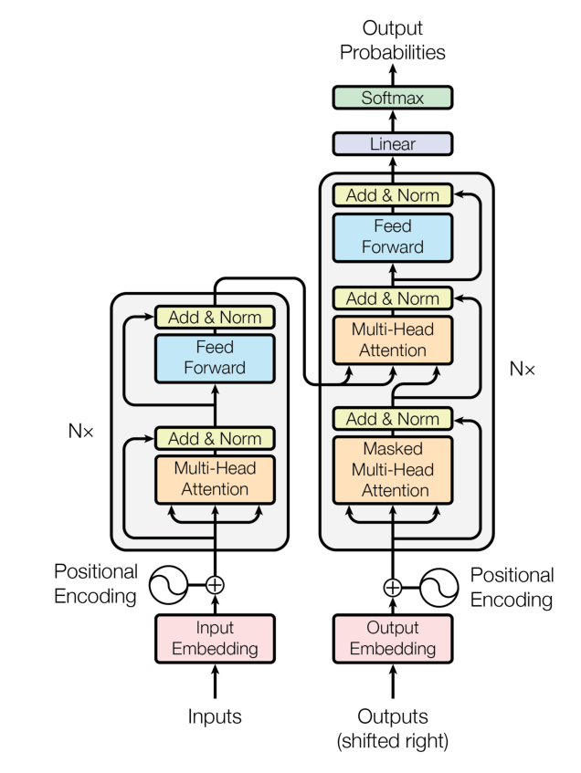

# CS336 Assignment 01


<!--more-->
Assignment 01 要求我们从0实现一个简单的语言模型训练流程，涵盖：

Tokenization 算法的实现
- 模型的定义
- 优化器的定义
- 训练代码

通过这一个Assignment，我们可以了解到创建一个完整的LM模型的全部流程，后续的课程以及Assignment都会基于这个流程进行扩展和优化。


## BPE Tokenizer Implementation
回顾一下BPE算法的基本步骤：

1. Initialization: 将输入文本视为字节序列，每个字节作为一个token。初始化词汇表包含所有可能的字节（0-255）。以及Special Tokens，比如 <|endoftext|>
2. Count Pairs: 统计文本中所有相邻字节对的出现频率。
3. Merge Pairs: 将频率最高的字节对其合并为一个新的token，更新文本和词汇表:
  - Get the most frequent pair: 找到出现频率最高的字节对。
  - Add the new pair: 将这个新的字节对加入词汇表。
  - Update the word counter: 更新文本中所有出现该字节对的地方。
  - Update Pairs Counts: 重新统计文本中所有相邻字节对的出现频率。
4. Repeat: 重复步骤2,3，直到达到预定的合并次数

BPE 的伪代码如下所示：

### BPE Version 0

假如我们要Tokenized以下的文本：

string = """ 
low low low low low <|endoftext|>
lower lower widest widest widest <|endoftext|>
newest newest newest newest newest newest 
"""

Step1 要做的就是初始化我们的词汇表：

```python
# 初始化我们的词汇表：
# vocab key: id, value: bytes
def init_vocab(special_tokens: list[str] | None = None) -> dict[int, bytes]:
    """
    这里的 vocab 字典首先填入了 256 个基本单元。这意味着无论输入的文本是什么编码，它最终都能被拆解为字节，从而保证 Tokenizer 永远不会遇到“未知字符”（out-of-vocabulary, OOV）。
    """
    vocab: dict[int, bytes] = {
        x: bytes([x]) for x in range(256)
    }  # idx -> byte representation
    current_index = 256

    if special_tokens is not None:
        for token in special_tokens:
            vocab[current_index] = token.encode("utf-8")
            current_index += 1

    return vocab
```

接下来我们来实现Step2: 统计文本中所有相邻字节对的出现频率。

```python
# 统计文本中所有相邻字节对的出现频率。
# word_counter是整个token序列出现多少次
# Key 是由 ID 组成的元组（表示单词目前的切分状态），Value 是该单词出现的次数。
@deprecated(
    "这个函数在 train_bpe.py 里已经被 merge_pairs_with_heap_index 替代了，因为它效率太低了。"
)
def pair_counts(word_counter: dict[tuple[int, ...], int]) -> dict[tuple[int, int], int]:
    pairs: dict[tuple[int, int], int] = {}
    for word, count in word_counter.items():
        # example: word = (10, 20, 30, 40)
        # list(zip(word, word[1:])) [(10, 20), (20, 30), (30, 40)]
        for a, b in zip(word[:-1], word[1:]):
            pairs[(a, b)] = pairs.get((a, b), 0) + count
    return pairs
```

我们先统计每个词（token 序列）出现的次数 count，再在遍历该词的相邻 token 对时，把每个 pair 的出现次数累加 count，从而得到全语料的 pair 频次。

接下来，我们需要实现 Step3.1: 找到出现频率最高的字节对。在这里，我们遵循的规则是：

1. 频率最高的pair
2. 若多个 pair 频率相同，我们按 pair 的字典序（先比左 token，再比右 token）选择更大的那个。

```python
# 找到出现频率最高的字节对
# 1. 频率最高的pair
# 2. 若多个 pair 频率相同，我们按 pair 的字典序（先比左 token，再比右 token）选择更大的那个。
@deprecated(
    "这个函数在 train_bpe.py 里已经被 pop_most_frequent_pair 替代了,不再遍历字典，而是直接看堆顶。"
)
def get_most_frequent_pair(pair_counter: dict[tuple[int, int], int]) -> tuple[int, int]:
    most_frequent_pair = max(pair_counter.items(), key=lambda item: (item[1], item[0]))
    return most_frequent_pair[0]
```
在这个函数中，我们使用了 Python 内置的 `max` 函数来找到频率最高的 pair。`key=lambda item: (item[1], item[0])` 这个参数告诉 `max` 函数首先比较 pair 的频率（item[1]），如果有多个 pair 频率相同，则比较它们的字典序（item[0]）。这样我们就能按照题目要求正确地选择最频繁的 pair。

most_frequent_pair[0]是本轮要 merge 的 pair（将它替换为一个新 token）

接下来，我们需要实现Step3.2: 将这个新的字节对加入词汇表：
```python
# 将这个新的字节对加入词汇表
def update_vocab(vocab: dict[int, bytes], pair: tuple[int, int]) -> int:
    index1, index2 = pair
    vocab[len(vocab)] = vocab[index1] + vocab[index2]
    return len(vocab) - 1
```

将这个新的pair加入词汇表后，我们需要实现 Step3.3 和 Step3.4: 更新文本中所有出现该字节对的地方，以及重新统计文本中所有相邻字节对的出现频率。 在这里，我们需要遍历所有的word，来看是不是有这个pair出现，若出现了，就将其合并成一个新的token。 同时，我们还需要重新统计所有的pair的频率。

```python


"""
假设我们的语料库里只有一个单词 "abac"，它出现了 10次。
此时，单词被拆解为最小单位（假设 a=1, b=2, c=3）：
word_counter: {(1, 2, 1, 3): 10}
pair_counter: {(1, 2): 10, (2, 1): 10, (1, 3): 10}
函数执行完毕，返回一个元组：
(
    # 第一个字典：告诉主循环，现在的单词长这样了
    {(99, 1, 3): 10},

    # 第二个字典：告诉主循环，下一轮你可以从这两对里选最高频的
    {(99, 1): 10, (1, 3): 10}
)
"""
@deprecated(
    "这个函数在 train_bpe.py 里已经被 build_pair_heap 替代了，因为它效率太低了。"
    "只在开头用一次build_pair_heap：它被改名或合并到了训练开始前的“初始统计”阶段，用来建立第一份 pair 频率堆。"
    "在 merge_pairs_with_heap_index 函数里，它从一个“全量统计函数”变成了“初始统计 + 增量更新”"
)
# 更新文本中所有出现该字节对的地方，以及重新统计文本中所有相邻字节对的出现频率
def merge_pair_ids(
    word_counter: dict[tuple[bytes, ...] | tuple[int, ...], int],
    pair: tuple[int, int],
    new_id: int,
) -> tuple[dict[tuple[int, ...], int], dict[tuple[int, int], int]]:
    new_word_counter: defaultdict[tuple[int, ...], int] = defaultdict(int)
    updated_pair_counter: defaultdict[tuple[int, int], int] = defaultdict(int)
    for token, freq in word_counter.items():
        new_token = []
        i = 0
        L = len(token)
        while i < L:
            if i < L - 1 and (token[i], token[i + 1]) == pair:
                new_token.append(new_id)
                i += 2
            else:
                new_token.append(token[i])
                i += 1
        new_word_counter[tuple(new_token)] += freq

        for index1, index2 in zip(new_token[:-1], new_token[1:]):
            updated_pair_counter[(index1, index2)] += freq

    return dict(new_word_counter), dict(updated_pair_counter)

```

至此，我们已经完成了一轮，重复以上的步骤，直到我们达到目标的轮数，放在一起代码就是：

```python

def train_bpe(
    string: str = string,
    vocab_size: int = 263,
    special_tokens: list[str] = special_tokens,
    save_path: str | None = None,
):
    vocab = init_vocab(special_tokens)
    num_merges = vocab_size - len(vocab)

    merges: dict[tuple[int, int], int] = {}

    word_counter = pre_tokenize(string, special_tokens, including_special=False)

    pairs_freqs = pair_counts(word_counter)

    for _ in range(num_merges):
        most_common_pair = get_most_frequent_pair(pairs_freqs)
        new_index = update_vocab(vocab, most_common_pair)
        merges[most_common_pair] = new_index
        word_counter, pairs_freqs = merge_pair_ids(word_counter, most_common_pair, new_index)
    
    return vocab, merges
```

这也就是我们最简单的BPE的算法，我们称其为BPE Version0。

我们可以看到，尽管这个版本的BPE算法是正确的，但是它的效率非常低，因为每次我们都需要遍历所有的pair，来找到出现频率最高的pair，这样的时间复杂度是$O(N*P)$，其中N是合并的次数，P是pair的数量。如果只是用这种简单的算法，我们是通不过测试的。因此我们需要优化这个算法，不过在优化之前，我们先来了解一下Pre-Processing的步骤。

### Pre-Processing

在实现BPE算法之前，我们需要对文本进行预处理（Pre-Processing），主要包括两个步骤：

1. 根据Special Tokens来分文本
2. 根据正则表达式来分文本

我们先来看一下根据Special Tokens来分文本的情况


我们已经了解过了，在初始化vocab 时，我们也需要初始化special tokens，其中一个常见的special tokens就是 <|endoftext|>. 这个token意味着一段文本的结束。给出一段很长的文本，我们要做的第一件事情就是把这个文本分成许多段，代码的实现如下：


```python


"""
通过把所有 special tokens 先按长度降序排序，
并用正则构造匹配 pattern，我们可以把原始长文本拆成一系列 普通文本片段（以及可选的 special token 片段）。
当 include_special=True 时，
re.split(f"({pattern})", text) 会把匹配到的 special token 也保留下来，从而在后续编码时我们可以把它们当作“原子 token”直接映射到对应的 id；
当 include_special=False 时，
special token 会作为分隔符被丢弃，仅返回普通文本片段，适合训练阶段不想让 special tokens 参与 pair 统计 / merges 的场景。
"""


def split_by_special_tokens(
    text: str, special_tokens: list[str], include_special: bool = False
) -> list[str]:
    if not special_tokens:
        return [text]
    special_tokens_sorted = sorted(special_tokens, key=len, reverse=True)
    pattern = "|".join(re.escape(t) for t in special_tokens_sorted)

    if include_special:
        parts = re.split(f"({pattern})", text)
    else:
        parts = re.split(pattern, text)
    return parts

```


至此，我们就完成了 Special Token-aware 的切分：

1. 通过把所有 special tokens 先按长度降序排序，并用正则构造匹配 pattern，我们可以把原始长文本拆成一系列 普通文本片段（以及可选的 special token 片段）。
2. 当 include_special=True 时，re.split(f"({pattern})", text) 会把匹配到的 special token 也保留下来，从而在后续编码时我们可以把它们当作“原子 token”直接映射到对应的 id；
3. 当 include_special=False 时，special token 会作为分隔符被丢弃，仅返回普通文本片段，适合训练阶段不想让 special tokens 参与 pair 统计 / merges 的场景。

接下来，我们就可以对每个普通片段执行Regular-based的切分了，在这个过程中，我们会把文本切成更小的片段，比如词、子词片段、标点分隔片段等。


Pre-Tokenization（预分词） 就是在真正训练 BPE 合并规则之前，先对整份语料做一次粗粒度的切分，把文本切成一段段“更大的片段”（pre-token），然后在这些片段内部去统计相邻字节（byte pair）的出现频率。、 那么，为什么需要Pre-Tokenization呢，主要有两个原因：

**原因一**：避免“每合并一次就全语料扫一遍”
我们知道，merge一次，我们就要重新扫描一次，以获得更新后的新语料，如果这个语料特别大，或者我们merge的次数特别多，那么就会导致我们算法特别的慢。
这个时候我们就需要Pre-Tokenization，它的作用是：

先把语料切成很多“pre-token”（比如词、子词片段、标点分隔片段等）
统计时不再对整个语料逐字符/逐字节扫描，而是利用重复出现的 pre-token 的次数来加速。
举个例子：

‘text’ 这个 pre-token 出现了 10 次
当我们要统计 ‘t’ 和 ‘e’ 相邻出现次数
只要在 ‘text’ 里看到一次 “t”+“e” 相邻，就可以一次性把计数加 10 而不是把语料里每个 ‘text’ 都逐字节再看一遍。


**原因二**：避免学出“只有标点不同”的重复 token
比如有两个词 dog! 和 dog. 如果我们那不Pre-tokenization，那么这个很容易被当成不同的序列，从而对于这个类似的词，有两个完全不同的IDs。而 Pre-tokenization 通常会用一些规则（比如按空白、标点边界等）先切开，让 BPE 更多在“词内部”学习合并规律，而不是把词和各种标点粘在一起乱合并。

在这个 Assignment 里，我们采用 regex-based pre-tokenizer（GPT-2 使用的那条正则），先把原始文本切成一串“预分词片段”（pre-tokens），再对每个片段做 byte-level BPE。

```python
PAT = r"""'(?:[sdmt]|ll|ve|re)| ?\p{L}+| ?\p{N}+| ?[^\s\p{L}\p{N}]+|\s+(?!\S)|\s+"""
```

有了这个正则表达式，我们就可以实现 Pre-Tokenization 了，代码如下：

```python

def pre_tokenize(
    string: str,
    special_tokens: list[str] | None = None,
    including_special: bool = False,
) -> Counter:
    word_counter = Counter()
    chunks = split_by_special_tokens(
        string, special_tokens, include_special=including_special
    )
    for chunk in chunks:
        if not chunk:
            continue
        if including_special and chunk in special_tokens:
            word_counter[tuple(string_to_bytes(chunk))] += 1
        else:
            for match in re.finditer(PAT, chunk):
                token = match.group(0)
                token_ids = tuple(string_to_bytes(token, return_int=True))
                word_counter[token_ids] += 1
    return word_counter
```

通过 pre-tokenization，我们把原始文本转换成许多“预分词片段”的 byte/id 序列，并用 Counter 统计每种片段出现的次数。后续在统计 pair 频率时，每个片段的相邻 token 对出现次数都会按其 count 加权累加，从而得到全语料的 pair 频次。

以上这两步（Special Token-aware Splitting 和 Regex-based Pre-Tokenization），我们可以通过一个 Multi-Processing


Python 的MultiProcessing 是一个- 多进程 更适合 CPU 密集型任务（比如预分词、统计）。，我们只需要了解以下的内容：

```python

from multiprocessing import Process, Queue  
import queue  
from collections import Counter 

def task(*args):  # 定义实际要并行执行的任务函数
    # ... do something ...  # 这里写你的真实任务逻辑
    return Counter()  # 返回一个 Counter（示例），便于主进程聚合

def task_worker(out_queue: Queue, *args):  # worker：接收输出队列和任务参数

    output = task(*args)  # 执行任务，得到部分结果
    
    out_queue.put(output)  # 把结果放进队列，交给主进程汇总

num_process = 4  # 进程数示例（你需要自己设置）
task_args_list = [("a",), ("b",), ("c",), ("d",)]  # 每个进程的参数示例（你需要替换成真实参数）

out_queue: Queue = manager.Queue() # 创建进程间通信队列
processes: list[Process] = []  # 保存所有进程对象，方便后面 join

for args in task_args_list:  # 遍历每个任务的参数
    p = Process(target=task_worker, args=(out_queue, *args))  # 创建进程，并把队列+参数传给 worker
    processes.append(p)  # 记录进程对象
    p.start()  # 启动进程开始执行

all_out = Counter()  # 主进程的总 Counter，用于累加所有部分结果

for _ in range(len(processes)):  # 预期每个进程都会 put 一次结果，所以收 len(processes) 次
    try:
        partial_out = out_queue.get(timeout=10)  # 从队列取一个结果，最多等待 10 秒
        all_out.update(partial_out)  # 把这个进程的 Counter 合并到总 Counter
    except queue.Empty:  # 如果超时没取到，就跳过
        continue  # 继续尝试下一个

for p in processes:  # 遍历所有进程
    p.join()  # 等待进程结束

```

有了这些前置知识之后，实现这个Pre-Processing的步骤就很容易了，以下是Pre-process的代码

```python

"""
如果没有这段代码，BPE 的 pre_tokenize 阶段会成为瓶颈：

单进程：读取 1GB 文件 -> 分词 -> 统计（耗时 10 分钟）。

多进程 (8核)：文件切 8 份 -> 8 个核心同时分词 -> 汇总（耗时约 1.5 分钟）。

这段代码通过文件指针定位 (seek) 和 进程间通信 (Queue)，
实现了对海量文本的高效预处理，为后续的 BPE 迭代打下了坚实的性能基础。
"""


def pre_tokenize_string_worker(*args):
    input_path, special_tokens, queue, start, end, include_special = args
    with open(input_path, "rb") as f:
        f.seek(start)
        chunk = f.read(end - start).decode("utf-8", errors="ignore")
    word_counter = pre_tokenize(
        chunk, special_tokens, including_special=include_special
    )
    queue.put(word_counter)

```

通过这个合集，我们的得到了 word_counter 这个变量. 它记录了每个 pre-token（byte/id 序列）在整个语料中出现的次数，接下来我们就可以基于这个 word_counter 来统计 pair 频次，并进行 BPE 合并了.

除了 word_counter（记录每个 word/token 序列出现次数）之外，我们还会额外构建两个辅助结构，来支持后续 更高效的 pair 统计与更新：

```python

pairs_counter = Counter()
pair_to_words: dict[tuple[int, int], set[tuple[int, ...]]] = defaultdict(set)
for word in word_counter:
    for i in range(len(word) - 1):
        pair = (word[i], word[i + 1])
        pair_to_words[pair].add(word)
        pairs_counter[pair] += word_counter[word]
```


- **pairs_counter**[pair]：**BPE Version 1的pop_most_frequent_pair函数延迟更新校验的时候用**。记录该相邻 pair 在全语料中的总出现次数。 因为每个 word 在语料中出现了 word_counter[word] 次，所以 word 内部每出现一次 pair，就为全局频次贡献 word_counter[word]。
- **pair_to_words**[pair]：**BPE Version 2的merge_pairs_with_heap_index函数用，新单词会产生新的 pair，旧单词会失效一些旧 pair**。记录该 pair 出现在哪些 word（token 序列）里, 这个映射非常关键：当我们选择某个 pair 进行 merge 时，只有包含该 pair 的 word 会发生变化。借助 pair_to_words，我们可以只遍历这些“受影响的 words”，并对 pairs_counter 做局部增量更新，而不是每轮都重新扫描全部 word_counter。


### BPE Version 1： 用堆优化“找最频繁 pair”的步骤


一个很明显的优化点是：每一轮都要找当前频率最高的 pair。我们每轮都通过遍历 pairs_counter 来取最大值，这一步是
（O(n),n是 pair 的数量）。而这个操作正好符合堆（heap）的使用场景：用堆维护“当前最大的元素”，就能把“取最大”降到
O(1)。
具体做法是把每个 pair 作为堆元素，并把“排序依据”设计成：

- 频次越大优先级越高
- 频次相同则按 pair 的字典序更大者优先
在 Python 的 heapq 是最小堆，因此我们可以用负号把它变成“最大堆”，例如存成：

key = (-freq, a, b)

常见最大堆写法

```python

import heapq

data = [1, 3, 5, 7, 9, 2, 4, 6, 8, 0]
# 1. 列表取负数
max_heap = [-x for x in data]
# 2. 堆化
heapq.heapify(max_heap)

# 3. 压入新元素（注意取负）
new_val = 10
heapq.heappush(max_heap, -new_val)

# 4. 弹出最大值（注意弹出后还原）
largest = -heapq.heappop(max_heap)
print(largest)  # 输出: 10
```

这样每一轮我们都能快速拿到候选的“最常见 pair”。

```python

class HeapItem:
    def __init__(
        self, neg_freq: int, pair_bytes: tuple[bytes, bytes], pair: tuple[int, int]
    ):
        """
        把频率取负数。比如频率 100 变成 -100，频率 50 变成 -50。在小顶堆里，-100 比 -50 小，所以 100 会先被弹出。
        """
        self.neg_freq = neg_freq
        self.pair_bytes = pair_bytes
        self.pair = pair

    def __lt__(self, other: "HeapItem") -> bool:
        if self.neg_freq != other.neg_freq:
            return self.neg_freq < other.neg_freq # 频率越高（负值越小），优先级越高
        return self.pair_bytes > other.pair_bytes  # 频率相同时，字节序大的优先


def build_pair_heap(pairs_freqs: Counter, vocab: dict[int, bytes]):
    heap = []
    for (a, b), f in pairs_freqs.items():
        if f > 0:
            item = HeapItem(-f, (vocab[a], vocab[b]), (a, b))
            heapq.heappush(heap, item)
    return heap


"""
核心思路：延迟更新 (Lazy Update)
堆优化的核心难点在于：当两个 ID 合并时，周围相邻 pair 的频率会发生变化，但我们不能立即去堆里修改它们（因为在 Python 的 heapq 中修改中间元素非常慢）。
解决办法：

不管它：频率变了就让它在堆里待着。

校验：每次从堆顶弹出（Pop）最强 pair 时，检查一下它的频率是否和当前 pairs_counter 里的真实频率一致。如果不一致，说明这个数据“过期”了，直接扔掉，看下一个。
"""
def pop_most_frequent_pair(heap, pairs_counter: Counter) -> tuple[int, int]:
    while heap:
        item = heap[0]  # Peek at the top item
        neg_f = item.neg_freq
        pair = item.pair
        # 真实的次数
        cur_f = pairs_counter.get(pair, 0)
        # 堆顶元素的次数是负数，所以取反得到真实频率
        if (
            cur_f <= 0 or -neg_f != cur_f
        ):  # frequency changed, which means the pair we store in heap is stale
            heapq.heappop(heap)
            continue
        return pair

    raise ValueError("No positive-frequency pairs remain")
```
场景： 假设堆里有一个 pair (a, b) 频率是 10。现在我们在语料库中合并了另一对 (x, y)，而这一操作导致 (a, b) 的实际频率变成了 8。

问题： 在 Python 的 heapq 中，找到并修改堆中间的某个元素是非常昂贵的（$O(N)$）。

解决方案（此代码的做法）：

- 不修改：让那个旧的 (a, b, freq=10) 留在堆里。

- 新插入：如果频率变了，直接 heappush 一个新的 (a, b, freq=8) 进去。

- 校验 (Validation)：

    - 当 pop_most_frequent_pair 弹出元素时，检查 if -neg_f != cur_f。

    - 如果堆里记录的频率（10）和 pairs_counter （全局维护的变量）里真实的频率（8）对不上，说明这是个“过时的残留物”，直接丢弃。

### BPE Version 2： 增量更新“受影响 pair”的频率

我们每一轮都会遍历 word_counter 里的所有 word，检查这个 word 里是否出现了目标 pair；这一步的代价通常非常高，因为绝大多数 word 根本不包含 当前要 merge 的 pair，但我们还是把它们都扫了一遍。

因此我们可以用一个“倒排索引”来做 空间换时间：提前维护一个映射 pair -> {words…}，记录每个 pair 出现在哪些 word 中。这样当我们决定 merge 某个 pair 时，就只需要遍历 pair_to_words[pair] 里的那一小部分 word，而不必全量扫描所有 word。

这也正是我们搭建 pair_to_words 的原因：

没有索引：每轮 merge 都是 全量扫描所有 words（慢，O(N)级别）。
有索引：每轮只处理 包含该 pair 的 words 子集（快，复杂度取决于该 pair 的覆盖范围，通常远小于全量）。
接下来，我们还需要在 merge 之后，更新这个索引：当某个 pair 被 merge 成一个新 token 后，所有包含该 pair 的 word 都会发生变化，因此我们需要把这些 word 从旧 pair 的索引里移除，并把它们添加到新 pair 的索引里。具体实现如下：

```python

def merge_pairs_with_heap_index(
    word_counter: dict[tuple[int, ...], int],
    pair_counter: Counter,
    target_pair: tuple[int, int],
    new_id: int,
    vocab: dict[int, bytes],
    pair_heap,
    pair_to_words: dict[tuple[int, int], set[tuple[int, ...]]],
) -> tuple[
    dict[tuple[int, ...], int],
    Counter,
    list,
    dict[tuple[int, int], set[tuple[int, ...]]],
]:
    # 保留未受影响单词计数；仅对受影响单词做“替换”
    new_word_counter: Counter = Counter(word_counter)
    updated_pair_counter: Counter = pair_counter.copy()
    changed_pairs: set[tuple[int, int]] = set()

    affected_words = list(pair_to_words.get(target_pair, set()))

    # 更新 pair_to_words 索引：新单词会产生新的 pair，旧单词会失效一些旧 pair
    for w in affected_words:
        freq = word_counter.get(w, 0)
        if freq <= 0 or len(w) < 2:
            continue
        # 1. 从词典计数中扣除旧单词的频率
        new_word_counter[w] -= freq
        if new_word_counter.get(w, 0) <= 0:
            del new_word_counter[w]
        # 2. 关键：清理旧邻居的频率
        """
        为什么要扣除所有相邻对？ 因为只要单词 w 发生了合并，
        它内部所有的相邻关系都会断开或重组。为了保证计数准确，必须先“归零”旧的贡献。
        """
        for i in range(len(w) - 1):
            pair = (w[i], w[i + 1])
            # 这些相邻对即将消失或改变
            updated_pair_counter[pair] -= freq
            # 标记这些 pair 需要重新入堆
            changed_pairs.add(pair)
            # 在索引里删掉旧单词
            s = pair_to_words.get(pair)
            if s is not None:
                s.discard(w)
                if not s:
                    del pair_to_words[pair]
        # 3. 构造新单词，并加入词典计数
        new_word = get_new_word(w, target_pair, new_id)
        new_word_counter[new_word] += freq

        # 4. 更新新单词的相邻对频率，并更新索引
        if len(new_word) < 2:
            continue
        for i in range(len(new_word) - 1):
            pair = (new_word[i], new_word[i + 1])
            updated_pair_counter[pair] += freq
            changed_pairs.add(pair)
            pair_to_words.setdefault(pair, set()).add(new_word)

    # 5. 把受影响的 pair 重新入堆
    if pair_heap is not None:
        for pair in changed_pairs:
            f = updated_pair_counter.get(pair, 0)
            if f > 0:
                """
                这里并没有去堆里寻找并删除旧数据（因为那太慢了），
                而是直接把最新的频率作为新任务 heappush 进去。
                这会导致堆里存在多个相同的 pair，但频率不同。
                但是堆自己会在pop_most_frequent_pair函数校验
                """
                heapq.heappush(
                    pair_heap, HeapItem(-f, (vocab[pair[0]], vocab[pair[1]]), pair)
                )
    return dict(new_word_counter), updated_pair_counter, pair_heap, pair_to_words

```

### Train BPE

将上面的实现，替换成我们最新的实现后，我们就可以实现BPE的算法：

```python
def train_bpe(
    input_path: str | os.PathLike,
    vocab_size: int,
    special_tokens: list[str] | None = None,
    verbose: bool = False,
    **kwargs,
) -> tuple[dict[int, bytes], list[tuple[bytes, bytes]]]:
    """
    计算合并次数：BPE 每次合并产生一个新 Token。
    目标词表大小减去初始的 256 个字节和特殊字符，就是我们需要执行循环的次数。
    初始状态：vocab 此时只包含最基础的单位（0-255）和特殊符号。
    """
    num_merges = vocab_size - 256 - (len(special_tokens) if special_tokens else 0)
    vocab: dict[int, bytes] = init_vocab(special_tokens)
    merges: list[tuple[bytes, bytes]] = []

    # 1. Pre-tokenization
    # 1.1 Find chunk boundaries
    # 切分文件
    with open(input_path, "rb") as f:
        chunk_boundaries = find_chunk_boundaries(
            f,
            desired_num_chunks=kwargs.get("desired_num_chunks", NUM_PROCESSES),
            split_special_token=b"\n",
        )

    if verbose:
        print_color(
            f"Identified {len(chunk_boundaries) - 1} chunks for pre-tokenization."
        )
    # 多进程并行
    # 1.2 Count word frequencies across chunks using multiprocessing
    manager = Manager()
    queue = manager.Queue()
    processes: list[Process] = []

    for start, end in zip(chunk_boundaries[:-1], chunk_boundaries[1:]):
        p = Process(
            target=pre_tokenize_string_worker,
            args=(input_path, special_tokens, queue, start, end, False),
        )
        processes.append(p)
        p.start()

    if verbose:
        print_color("Pre-tokenization processes completed. Aggregating results...")

    # 等待所有子进程结束，然后再收集词频，避免在长语料下超时导致结果丢失
    for p in processes:
        p.join()
        if p.exitcode is not None and p.exitcode != 0:
            raise RuntimeError(
                f"Pre-tokenization process failed with exit code {p.exitcode}."
            )

    word_counter = Counter()
    while True:
        try:
            partial_counter = queue.get(timeout=1)
            # 主进程使用 word_counter.update 将所有人的结果加在一起。
            # 结果：此时我们得到了语料库中所有词（以字节元组形式）出现的频率
            word_counter.update(partial_counter)
        except Empty:
            break

    if verbose:
        print_color(
            f"Completed pre-tokenization. Vocabulary size: {len(word_counter)} unique tokens."
        )

    """
    pairs_counter[pair]：记录该相邻 pair 在全语料中的总出现次数。 因为每个 word 在语料中出现了 word_counter[word] 次，所以 word 内部每出现一次 pair，就为全局频次贡献 word_counter[word]。
    pair_to_words[pair]：记录该 pair 出现在哪些 word（token 序列）里, 这个映射非常关键：当我们选择某个 pair 进行 merge 时，只有包含该 pair 的 word 会发生变化。
    借助 pair_to_words，我们可以只遍历这些“受影响的 words”，并对 pairs_counter 做局部增量更新，而不是每轮都重新扫描全部 word_counter。
     """
    pairs_counter = Counter()
    pair_to_words: dict[tuple[int, int], set[tuple[int, ...]]] = defaultdict(set)
    for word in word_counter:
        for i in range(len(word) - 1):
            pair = (word[i], word[i + 1])
            pair_to_words[pair].add(word)
            pairs_counter[pair] += word_counter[word]

    # 2. BPE Core Loop
    # 建立最大堆
    pair_heap = build_pair_heap(pairs_counter, vocab)

    for i in trange(num_merges):
        # 获取当前最强组合
        most_frequent_pair = pop_most_frequent_pair(pair_heap, pairs_counter)
        # 更新词表并获取新 ID
        new_id = update_vocab(vocab, most_frequent_pair)
        # 局部精准合并（这是最核心的性能优化点）
        word_counter, pairs_counter, pair_heap, pair_to_words = (
            merge_pairs_with_heap_index(
                word_counter,
                pairs_counter,
                most_frequent_pair,
                new_id,
                vocab,
                pair_heap,
                pair_to_words,
            )
        )
        # 记录合并规则
        merges.append((vocab[most_frequent_pair[0]], vocab[most_frequent_pair[1]]))
    # 将训练好的 vocab 和 merges 存入磁盘。
    # 这样在之后的分词阶段（Inference），你可以直接加载它们，而不需要重新训练。
    if kwargs.get("save_path"):
        save_vocab_and_merges(vocab, merges, kwargs["save_path"])
        with open(
            os.path.join(kwargs["save_path"], "special_tokens.txt"),
            "w",
            encoding="utf-8",
        ) as f:
            if special_tokens:
                for token in special_tokens:
                    f.write(f"{token}\n")

    return vocab, merges
```

### BPE Tokenizer

有了vocab merges 我们可以实现一个BPE Tokenizer

```python
class BPETokenizer:
    def __init__(
        self,
        vocab: dict[int, bytes],
        merges: list[tuple[bytes, bytes]],
        special_tokens: list[str] | None = None,
    ):
        self.vocab = vocab
        self.merges = merges
        self.special_tokens = special_tokens if special_tokens else []
        self.special_tokens_bytes = [t.encode("utf-8") for t in self.special_tokens]
        self.special_set = set(self.special_tokens_bytes)

        self.vocab_inv = {v: k for k, v in self.vocab.items()}

        # 记录合并的优先级。在 merges 列表里越靠前（r 越小），优先级越高。
        # 比如遇到 h e l l o，如果 h e 排第 1，l l 排第 5，那就必须先合并 h e。
        rank: dict[tuple[int, int], int] = {}
        # 速查表。直接记录 (ID_h, ID_e) -> ID_he。有了它，合并时瞬间就能拿到新 ID。
        merge_to_new_id: dict[tuple[int, int], int] = {}

        for r, (a_bytes, b_bytes) in enumerate(self.merges):
            a_id = self.vocab_inv.get(a_bytes)
            b_id = self.vocab_inv.get(b_bytes)
            # The merged token should be present in vocab; if not, skip this merge rule.
            new_id = self.vocab_inv.get(a_bytes + b_bytes)
            if a_id is None or b_id is None or new_id is None:
                continue
            pair = (a_id, b_id)
            rank[pair] = r
            merge_to_new_id[pair] = new_id

        self.rank = rank
        self.merge_to_new_id = merge_to_new_id

        self.eos_token_id = self.vocab_inv.get(b"<|endoftext|>", None)

    """
    当拿到一句长长的文本，比如 "Hello world! <|endoftext|>"，不能直接把它全拆成单字母。

    保护特殊符号：把 <|endoftext|> 这种单独拎出来，它不参与合并。

    正则切分（PAT）：把 "Hello world!" 切成 "Hello", " ", "world", "!"。

    转成 Bytes：最后把每个碎片转成 utf-8 字节。
    """

    def _pre_tokenize(self, text: str) -> list[bytes]:
        parts = split_by_special_tokens(text, self.special_tokens, include_special=True)
        token_list: list[bytes] = []

        for part in parts:
            if part == "":
                continue
            if part in self.special_tokens:
                token_list.append(part.encode("utf-8"))
            else:
                for tok in re.findall(PAT, part):
                    # Each regex token becomes a single bytestring.
                    token_list.append(tok.encode("utf-8"))

        return token_list

    """
    如果用普通的数组来合并，每次把两个元素变成一个元素，数组后面的所有元素都要往前挪一位。如果句子很长，这种操作会慢得让人崩溃。
    这段代码使用了一个高级数据结构组合：双向链表 (Doubly-Linked List) + 优先队列/堆 (Heap)。
    """

    def encode(self, text: str) -> list[int]:
        def merge_one_pretoken(ids: list[int]) -> list[int]:
            n = len(ids)
            if n <= 1:
                return ids

            """
            合并时并不真的 del 掉元素，而是：
            标记被吞掉的节点 alive[j] = False
            调整指针 nxt[i] = nxt[j]、prev[nxt[j]] = i
            这样就能在 O(1) 时间内完成合并，而不需要移动后续元素。
            """
            alive = [True] * n

            # Doubly-linked list over positions 0..n-1 (positions are stable; nodes get "deleted")
            prev = [-1] * n
            nxt = [-1] * n
            for i in range(n):
                prev[i] = i - 1
                nxt[i] = i + 1 if i + 1 < n else -1
            """
            堆里存 (rank, i)，
            表示当前位置 i 与其右邻居 nxt[i] 的 pair 在 merge 规则中的优先级（rank 越小越先合并）。
            每次取出最小 rank 的候选，做一次合并，然后只需要重新检查局部的两个 pair：

            (prev[i], i)
            (i, nxt[i])

            """
            # best pair per left-position i: (rank, i)
            heap: list[tuple[int, int]] = []

            def push_if_valid(i: int):
                cur_r = None
                j = nxt[i]
                if j == -1 or not alive[i] or not alive[j]:
                    cur_r = None
                else:
                    cur_r = self.rank.get((ids[i], ids[j]))

                if cur_r is not None:
                    heapq.heappush(heap, (cur_r, i))

            for i in range(n):
                push_if_valid(i)
            """

            与之前的heap一样，heap里面的内容会 “过期”：
            因为合并会改变邻接关系，堆中旧条目会过期，所以每次 pop 出来都要验证,

            接下来就是遍历这个heap，
            如果这个heap不是空的，我们就弹出，并且验证：

            这段 while heap: 是整个 merge_one_pretoken 的核心：
            堆里维护“当前可合并的相邻 pair”，
            每次取出 rank 最小（最优先） 的候选进行合并，并只更新合并点附近的候选。
            """
            while heap:  # 只要还有候选 pair，就继续尝试合并
                r, i = heapq.heappop(
                    heap
                )  # 取出当前 rank 最小的候选：(rank, 左端点位置 i)
                j = nxt[i]  # 右端点位置 j 是 i 在链表中的后继
                if (
                    j == -1 or not alive[i] or not alive[j]
                ):  # i/j 无效或 i 已到尾部：这是过期候选
                    continue
                # stale check：堆里的记录可能已过期（邻居关系/ids 已改变），需要重新验证
                # 注意后面合并后nxt[i]会变，所以每次都要检查当前 i 和 j 的 pair 是否仍然匹配当前 rank
                pair = (ids[i], ids[j])
                cur_r = self.rank.get(
                    pair
                )  # 查询这个 pair 在 merge 规则中的 rank（不可合并则为 None）
                if (
                    cur_r is None or cur_r != r
                ):  # 现在不可合并，或 rank 已不匹配：说明堆元素过期
                    continue

                # 执行合并：把 (ids[i], ids[j]) 合成一个新 token，并写回到位置 i
                new_id = self.merge_to_new_id.get(pair)
                if new_id is None:
                    continue
                ids[i] = new_id

                # 从链表中删除 j：j 被 i 吞掉了
                alive[j] = False
                nj = nxt[j]
                nxt[i] = nj
                if nj != -1:
                    prev[nj] = i

                # 局部更新：合并只会影响 i 附近的两个相邻 pair
                pi = prev[i]
                if pi != -1:
                    push_if_valid(pi)  # (pi, i) 这个 pair 可能变得可合并或 rank 改变
                push_if_valid(i)  # (i, nxt[i]) 这个 pair 也可能变得可合并或 rank 改变

            # 最终合并后的 token id 序列
            out: list[int] = []
            k = 0
            while k != -1:
                if alive[k]:
                    out.append(ids[k])
                k = nxt[k]
            return out

        byte_tokens = self._pre_tokenize(text)

        """
        Pre-tokenization：先粗粒度切分文本
        对每个切分出来的 pre-token 做 BPE merge (merge_one_pretoken)，得到最终的 token ID 序列。
        """
        token_ids: list[int] = []
        for btok in byte_tokens:
            if btok in self.special_set:
                token_ids.append(self.vocab_inv[btok])
            else:
                ids = [self.vocab_inv[bytes([b])] for b in btok]
                token_ids.extend(merge_one_pretoken(ids))

        return token_ids

    def encode_iterable(self, iterable: Iterable[str]) -> Iterator[int]:
        # Placeholder for iterable encoding logic
        for text in iterable:
            yield from self.encode(text)

    def decode(self, ids: list[int]) -> str:
        # https://en.wikipedia.org/wiki/Specials_(Unicode_block)#Replacement_character

        tokens = b"".join(self.vocab.get(i, b"\xef\xbf\xbd") for i in ids)
        return tokens.decode("utf-8", errors="replace")

    @classmethod
    def from_files(
        cls,
        vocab_filepath: str,
        merges_filepath: str,
        special_tokens: list[str] | str | None = None,
    ) -> "BPETokenizer":
        with open(vocab_filepath) as vf:
            vocab_data = json.load(vf)
            vocab = {int(i): bytes(v, "latin1") for v, i in vocab_data.items()}

        merges = []
        with open(merges_filepath) as mf:
            # Skip the first line (header)
            next(mf)
            for line in mf:
                if line.strip() and not line.startswith("#"):
                    parts = line.strip().split()
                    if len(parts) == 2:
                        merges.append(
                            (bytes(parts[0], "latin1"), bytes(parts[1], "latin1"))
                        )

        if isinstance(special_tokens, str):
            with open(special_tokens, encoding="utf-8") as stf:
                special_tokens_list = [line.strip() for line in stf if line.strip()]
        elif isinstance(special_tokens, list):
            special_tokens_list = special_tokens
        else:
            special_tokens_list = []

        return cls(vocab, merges, special_tokens_list)
```

BPE Tokenizer 主要实现三个功能：

1. encode：把字符串编码成 token IDs 列表
2. encode_iterable：把字符串编码成 token IDs 生成器
3. decode：把 token IDs 列表解码成字符串

这个encode主要做两个事情：

1. Pre-tokenization：先粗粒度切分文本
2. 对每个 pre-token 做 BPE merge


第一步和我们之前实现的一样，对于第二步，主要的实现方法在 merge_one_pretoken 中实现。 
在这个函数中，我们通过Heap和Double Linked List 来高效实现这个Encode。如果用普通的 list 进行合并，每次删除两个元素插入一个新元素，时间复杂度是 $O(N^2)$。这段代码利用“双向链表 + 延迟更新堆”将复杂度降到了 $O(N \log N)$。

首先，我们用数组来模拟双向链表：

```python
prev = [-1] * n
nxt  = [-1] * n
alive = [True] * n
```


合并时并不真的 del 掉元素，而是：

- 标记被吞掉的节点 `alive[j] = False`
- 调整指针 `nxt[i] = nxt[j]`、`prev[nxt[j]] = i`
这样每次合并都是 $O(1)$ 的时间复杂度。


**为什么用双向链表？**
1. 在数组中删除元素要移动后面所有的元素。
2. 在双向链表中，合并 ids[i] 和 ids[j] 只需要：
   1. 把 ids[i] 的值改掉。
   2. 让 nxt[i] 指向 j 的下一个节点。
   3. 标记 j 为 alive = False。
   4. 结果：所有位置的索引（index）在内存中保持不动，合并操作变成 $O(1)$。

**堆与优先级**

堆与优先级代码维护了一个堆，里面存的是 (priority_rank, position_i)。
1. 语义：位置 i 和它右边的邻居 nxt[i] 组成的这对 Pair，其合并优先级是多少？
2. 每次从堆顶弹出 rank 最小（即最优先）的一对进行合并。

**延迟更新 (Stale Check)**
当你合并了位置 i 和 j：位置 i 左右两边的邻居关系都变了。

原来在堆里的 (prev[i], i) 的优先级可能变了，(i, nxt[j]) 的优先级也变了。

- 策略：代码并不去堆里“寻找并删除”旧的记录（太慢），而是直接把新的优先级对 push 进堆。
- 校验：当从堆中弹出元素时，通过 if cur_r is None or cur_r != r 
- 检查：如果当前这一对的真实优先级和堆里存的不一样，说明这是个“过时”的记录，直接丢弃。

接下来就是遍历这个heap，如果这个heap不是空的，我们就弹出，并且验证：

这段 while heap: 是整个 merge_one_pretoken 的核心：堆里维护“当前可合并的相邻 pair”，每次取出 rank 最小（最优先） 的候选进行合并，并只更新合并点附近的候选。

最后我们只需要把链表结构还原成最终的token序列即可：

在 BPE 合并阶段，我们用 prev / nxt / alive 维护了一个“数组模拟的双向链表”。合并时并不会真的删除 ids 里的元素，而是把被吞掉的位置标记为 alive=False，并通过 nxt 跳过它们。
因此在所有合并完成后，需要把“还活着的节点”按顺序重新收集成一个紧凑的输出序列：

### Tokenize and Save File

有了 tokenizer.encode() 之后，我们通常会希望把一整个文本文件编码成 紧凑的二进制（.bin），方便后续训练时用 np.memmap 之类的方式高效加载，而不是每次都重新分词。

下面这段函数做的事情很简单：按行读取文本 → 把每行编码成 token ids → 用固定 dtype 写入二进制文件。

```python
def encode_file_to_bin(tokenizer, text_path, out_bin_path, dtype=np.uint16):
    total_bytes = os.path.getsize(text_path)

    with open(text_path, encoding="utf-8") as f_in, open(out_bin_path, "wb") as f_out:
        p_bar = tqdm(total=total_bytes, desc="Encoding to binary", unit="B", unit_scale=True)

        for line in f_in:
            token_ids = tokenizer.encode(line)          # 1) 把一行文本编码成 token ids
            arr = np.array(token_ids, dtype=dtype)      # 2) 转成 numpy 数组（更适合写二进制）
            arr.tofile(f_out)                           # 3) 直接以二进制写入 .bin 文件

            p_bar.update(len(line.encode("utf-8")))     

```

### 总结

#### 核心目标
从零实现 BPE Tokenizer，完成文本 → Token IDs 的完整流程。

---

#### 一、算法流程（BPE 三版迭代）

**Version 0（基础版）**：初始化 256 字节词表 → 统计相邻字节对频率 → 反复合并最高频 pair，直到达到目标词表大小。正确但慢，每轮全量遍历所有 pair，复杂度 $O(N \times P)$。

**Version 1（堆优化）**：用最大堆维护 pair 频率，"取最频繁 pair" 从 $O(P)$ 降到 $O(1)$。核心技巧：**延迟更新**——pair 频率变化时不修改堆，而是直接 push 新记录，pop 时校验是否过期。

**Version 2（倒排索引）**：额外维护 `pair_to_words` 映射，记录每个 pair 出现在哪些词中。merge 时只遍历受影响的词，做**增量更新**，避免每轮全量扫描。

---

#### 二、Pre-Processing

训练前需两步切分：

1. **Special Token 切分**：按 `<|endoftext|>` 等特殊符号先分段，special token 不参与 pair 统计。
2. **正则预分词**（GPT-2 PAT）：将普通文本切成词/子词/标点片段（pre-token），统计时对同一片段的所有出现次数一次性累加，大幅提速。

两步合并后得到 `word_counter`（pre-token 字节序列 → 出现次数），以及 `pairs_counter`、`pair_to_words` 两个辅助结构。**多进程并行**处理大文件，按块分配，子进程结果通过 Queue 汇总。

---

#### 三、BPE Tokenizer（Encode/Decode）

**encode** 的两步：
1. 预分词（同训练阶段）
2. 对每个 pre-token 执行 BPE merge（`merge_one_pretoken`）

`merge_one_pretoken` 用**数组模拟双向链表 + 延迟更新堆**实现，将朴素 $O(N^2)$ 降至 $O(N \log N)$：
- 链表：合并时只改指针和 `alive` 标记，不移动数组元素，单次合并 $O(1)$
- 堆：按 merge rank 排序候选 pair，pop 时做 stale check 校验是否过期

**decode**：直接将 token ID 序列拼接对应字节，UTF-8 解码输出。

---

#### 四、训练结果保存

训练完成后将 `vocab` 和 `merges` 序列化到磁盘；推理时直接加载，无需重新训练。文本文件可通过 `encode_file_to_bin` 编码为紧凑二进制（`.bin`），便于训练时用 `np.memmap` 高效读取。


## Language Model Implementation



可以看到，模型主要由以下几个模块组成：

1. Embedding Layer: 将输入的token IDs转化为dense vectors。
2. Transformer Blocks: 包含多层自注意力机制和前馈神经网络。
3. Normalization Layer: 使用RMS-Norm对输入进行归一化处理。
4. Multi-Head Self-Attention: 实现自注意力机制，允许模型关注输入序列的不同部分。
5. Feed-Forward Network: 由两个线性层和一个激活函数组成。
6. Output Layer: 将Transformer的输出映射回词汇表大小的logits，用于预测下一个token。


### Linear Module


Linear Module 基本是所有神经网络的起始点，它的定义如下:

$\text{Linear}(x) = xW^T + b$

我们将 bias 设为可选项，默认不使用 bias，这样可以更好地模拟 Transformer 中的 Linear Layer。

```python
import torch.nn as nn
import torch


class Linear(nn.Module):

    def __init__(
        self,
        in_features,
        out_features,
        device: torch.device | None = None,
        dtype: torch.dtype | None = None,
        bias: bool = False,
    ):
        super().__init__()

        self.in_features = in_features
        self.out_features = out_features

        self.weight = nn.Parameter(
            torch.empty((in_features, out_features), device=device, dtype=dtype)
        )
        self.bias = (
            nn.Parameter(torch.empty(out_features, device=device, dtype=dtype))
            if bias
            else None
        )
        self._init_weight()

    def forward(self, x):
        o = x @ self.weight
        if self.bias is not None:
            o = o + self.bias
        return o

    def _init_weight(self):
        mean = 0.0
        std = 1.0 / (2 * (self.in_features + self.out_features) ** 0.5)
        torch.nn.init.trunc_normal_(
            self.weight, mean=mean, std=std, a=-3 * std, b=3 * std
        )
```

其中 _init_weight() 是初始化的方法， 在Assignment 1 中为：

$\mathcal{N}\left( \mu = 0, \sigma^{2}=\frac{2}{d_{\text{in}} + d_{\text{out}}} \right) \quad \text{truncated at}  [-3\sigma, 3\sigma ]$


### Embedding Model
记得我们在前面第一章节，实现了BPE的Tokenization，回顾一下，Tokenization的步骤就是把文字，转化成一个个的IDs。 但是这个IDs是不能被模型处理的，我们需要将其转化成一个个的Dense Vector，这个就是所谓的 Embedding。

Embedding 的数学定义如下：

$\text{Embedding}(x) = \mathbf{W}_{e}[x]$

```python
import torch
import torch.nn as nn


class Embedding(nn.Module):
    def __init__(
        self,
        num_embeddings: int,
        embedding_dim: int,
        device: torch.device | None = None,
        dtype: torch.dtype | None = None,
    ):
        super().__init__()

        self.num_embeddings = num_embeddings
        self.embedding_dim = embedding_dim

        self.weight = nn.Parameter(
            torch.empty((num_embeddings, embedding_dim), device=device, dtype=dtype)
        )

        self._init_weight()

    def forward(self, x: torch.Tensor) -> torch.Tensor:
        B, L = x.shape  # x: (B, L)
        out = x.reshape(-1)  # (B*L,)
        out = self.weight.index_select(0, out)  # (B*L, D)
        out = out.reshape(B, L, self.embedding_dim)  # (B, L, D)

        return out

    def _init_weight(self):
        torch.nn.init.trunc_normal_(self.weight, mean=0.0, std=1, a=-3, b=3)
```

Embedding 本质上就是一个查表操作，它有一个更朴素的别名：查找表。

假设你有 10,000 个不同的词（num_embeddings = 10000），你想把每个词表示成一个 512 维的向量（embedding_dim = 512）。
那么 self.weight 就是一个形状为 (10000, 512) 的矩阵。矩阵的第 i行，就是第i个词的向量表示。

因为加了 nn.Parameter，所以这个矩阵里的所有数字都是可学习的，会在反向传播时被梯度更新。

输入 x 通常是一个 2D 的张量，形状是 (B, L)：

B (Batch Size)：批次大小，比如同时处理 8 条句子。
L (Sequence Length)：序列长度，比如每条句子有 128 个 token。
其实在forward中，我们只需要使用 self.weight[x] 这一行代码，就可以实现 Embedding 的功能， 但是为了更清晰地展示 Embedding 的工作原理，我们使用了 index_select() 来实现。为什么不直接写 return self.weight[x] 呢？

显式内存连续性：reshape(-1) 会把输入压平成一维，index_select(0, out) 直接在一维索引上查表，这种写法在某些情况下比直接用 2D 索引 self.weight[x] 更能避免底层内存不连续导致的隐式拷贝，效率更高。
逻辑清晰：明确表达了“先展平 -> 按行查表 -> 恢复形状”的物理过程。

### RMSNorm

归一化核心是为了让不同层输入的取值范围或者分布能够比较一致。由于深度神经网络中每一层的输入都是上一层的输出，因此多层传递下，对网络中较高的层，之前的所有神经层的参数变化会导致其输入的分布发生较大的改变。也就是说，随着神经网络参数的更新，各层的输出分布是不相同的，且差异会随着网络深度的增大而增大。但是，需要预测的条件分布始终是相同的，从而也就造成了预测的误差。

因此，在深度神经网络中，往往需要归一化操作，将每一层的输入都归一化成标准正态分布。批归一化是指在一个 mini-batch 上进行归一化，相当于对一个 batch 对样本拆分出来一部分，首先计算样本的均值：

$$\mu = \frac{1}{m} \sum_{i=1}^{m} x_i$$

其中，$x_i$ 是样本 x 在第 i 个维度上的值，m 就是 mini-batch 的大小。

再计算样本的方差：
$$\sigma^2 = \frac{1}{m} \sum_{i=1}^{m} (x_i - \mu)^2$$

最后，对每个样本的值减去均值再除以标准差来将这一个 mini-batch 的样本的分布转化为标准正态分布：

$$\hat{x_i} = \frac{x_i - \mu}{\sqrt{\sigma^2 + \epsilon}}$$

此处加上$\epsilon$这一极小量是为了避免分母为0。

到这里只是LayerNorm的定义。

RMSNorm（Root Mean Square Layer Normalization）是一种归一化方法，和 LayerNorm 类似，但不使用均值，而是直接用输入的均方根来归一化。它的定义如下：

$$\text{RMSNorm}(x) = \frac{x}{\sqrt{\frac{1}{d} \sum_{i=1}^{d} x_i^2 + \epsilon}} \cdot \gamma$$

其中：
- $x$ 是输入向量。
- $d$ 是输入向量的维度。
- $\epsilon$ 是一个小常数，防止除以零。
- $\gamma$ 是一个可学习的缩放参数，通常是一个与输入维度相同的向量。
- $\sqrt{\frac{1}{d} \sum_{i=1}^{d} x_i^2}$ 是输入向量的均方根（RMS），用来归一化输入。

**本质上来说就是分子分母都不减去均值了**，直接用输入的均方根来归一化。RMSNorm 在某些情况下可以提供更稳定的训练，尤其是在 Transformer 模型中被广泛使用。

```python
import torch
import torch.nn as nn


class RMSNorm(nn.Module):
    def __init__(
        self,
        d_model: int,
        eps: float = 1e-5,
        device: torch.device | None = None,
        dtype: torch.dtype | None = None,
    ):
        super().__init__()

        self.d_model = d_model
        self.eps = eps

        self.weight = nn.Parameter(torch.ones(d_model, device=device, dtype=dtype))

    def _rms(self, x: torch.Tensor) -> torch.Tensor:
        return torch.sqrt(torch.mean(x**2, dim=-1, keepdim=True) + self.eps)

    def forward(self, x: torch.Tensor) -> torch.Tensor:
        input_dtype = x.dtype
        x = x.to(torch.float32)

        rms = self._rms(x)
        x_normed = x / rms

        return (x_normed * self.weight).to(input_dtype)
```

Normalization的位置也是很有讲究的，在现代的LM中，通常用Pre-Norm，这一部分，等我们介绍完了所有的模块之后再来介绍。

### FFN

在原始 Transformer (Vaswani et al. 2023)里，FFN(Feed Forward Network, 前馈神经网络) 是一个非常经典的两层结构：Linear → ReLU → Linear，并且中间隐层维度通常取 `d_ff = 4 * d_model`。但到了现代大语言模型（例如 Llama 3、Qwen 2.5），FFN 的设计出现了两个几乎“标配”的变化：

1. 换激活函数
2. 引入门控（gating）机制。

先看SiLU激活函数（又叫Swish）：
$$\text{SiLU}(x) = x \cdot \sigma(x) = \frac{x}{1 + e^{-x}}$$

它和 ReLU 一样能提供非线性，但在 0 附近是平滑的，梯度行为更连续。再看 GLU，它用一个 sigmoid 分支充当“门”，去调节另一条线性分支：
$$\text{GLU}(x) = (W_1x) \otimes \sigma(W_2x)$$
其中 $W_1$ 和 $W_2$ 是两个不同的权重矩阵，$\otimes$ 表示逐元素乘法。GLU 的核心思想是：
- $W_1x$ 生成一个“候选”向量，包含了潜在的特征信息。
- $W_2x$ 生成一个“门控”向量，经过 sigmoid 后每个元素在 (0, 1) 之间，用来调节对应位置的候选特征的强弱。
- 最终输出是候选向量和门控向量的逐元素乘积，这样模型就可以动态地控制每个特征的流动，增强了表达能力。

直觉上，这种门控能给梯度提供一条更“线性”的通路，同时保留非线性表达能力。把两者拼起来就是 SwiGLU在 FFN 中的写法：
$$\text{FFN(x)}=\text{SwiGLU}(x) = W_2(\text{SiLU}(W_1x) \otimes (W_3x))$$

```python
import torch
import torch.nn as nn


def silu(x: torch.Tensor) -> torch.Tensor:
    return x * torch.sigmoid(x)


class FFN(nn.Module):
    def __init__(
        self,
        d_model: int,
        d_ff: int,
        device: torch.device | None = None,
        dtype: torch.dtype | None = None,
    ):
        super().__init__()

        from cs336_basics.modules.linear import Linear

        self.up = Linear(d_model, d_ff, device=device, dtype=dtype)
        self.down = Linear(d_ff, d_model, device=device, dtype=dtype)
        self.gate = Linear(d_model, d_ff, device=device, dtype=dtype)

    def forward(self, x: torch.Tensor) -> torch.Tensor:
        return self.down(silu(self.up(x)) * self.gate(x))
```

### RoPE位置编码

Transformer 本身对序列的顺序并不敏感，因此需要把位置信息注入到注意力机制里。除了常见的绝对位置编码（absolute PE），现代 LLM 更常用的一类方法是 Rotary Position Embeddings（RoPE) (Su et al. 2023)：它不是把位置向量“加到 embedding 上”，而是对 Q/K 向量做按维度成对的旋转，从而让注意力天然具备相对位置信息。

位置编码，即根据序列中 token 的相对位置对其进行编码，再将位置编码加入词向量编码中。位置编码的方式有很多，Transformer 使用了正余弦函数来进行位置编码（绝对位置编码Sinusoidal），其编码方式为：
$$\text{PE}_{(pos, 2i)} = \sin\left(\frac{pos}{10000^{2i/d_{\text{model}}}}\right)$$
$$\text{PE}_{(pos, 2i+1)} = \cos\left(\frac{pos}{10000^{2i/d_{\text{model}}}}\right)$$

上式中，pos 为 token 在句子中的位置，2i 和 2i+1 则指示了位置编码向量的维度索引是奇数还是偶数，从上式中我们可以看出对于奇数维度和偶数维度，Transformer 采用了不同的函数进行编码。


这样的位置编码主要有两个好处：

使 PE 能够适应比训练集里面所有句子更长的句子，假设训练集里面最长的句子是有 20 个单词，突然来了一个长度为 21 的句子，则使用公式计算的方法可以计算出第 21 位的 Embedding。
可以让模型容易地计算出相对位置，对于固定长度的间距 k，PE(pos+k) 可以用 PE(pos) 计算得到。因为 Sin(A+B) = Sin(A)Cos(B) + Cos(A)Sin(B), Cos(A+B) = Cos(A)Cos(B) - Sin(A)Sin(B)。

RoPE 的核心思想是对 Q/K 向量进行旋转，使得注意力机制能够捕捉到相对位置信息。具体来说，RoPE 将每个 token 的位置编码表示为一个旋转矩阵，然后将这个旋转应用到对应的 Q/K 向量上。这样，在计算注意力权重时，模型不仅考虑了 token 之间的内容关系，还隐式地考虑了它们之间的相对位置关系。

#### 旋转矩阵

在线性代数与空间几何中，旋转矩阵 $R$ 是用于实现向量或坐标系旋转变换的方阵。它属于**正交矩阵**，且行列式恒为 $+1$（即属于特殊正交群 $SO(n)$）。

坐标变换的基本关系式为：
$$ \mathbf{v}' = R \mathbf{v} $$
其中，$\mathbf{v}$ 为原坐标系下的向量，$\mathbf{v}'$ 为旋转后的新向量。

在二维平面中，向量绕坐标原点逆时针旋转 $\theta$ 角的旋转矩阵为：

$$ R_2(\theta) = \begin{bmatrix} \cos\theta & -\sin\theta \\ \sin\theta & \cos\theta \end{bmatrix} $$

展开为线性方程组形式：
$$ \begin{cases} x' = x\cos\theta - y\sin\theta \\ y' = x\sin\theta + y\cos\theta \end{cases} $$

#### 旋转矩阵的核心性质

在工程推导中，旋转矩阵 $R$ 的以下性质被频繁使用：

1. **正交性**：
   $$ R^T R = R R^T = I $$
   其中 $R^T$ 为 $R$ 的转置，$I$ 为单位矩阵。
2. **逆矩阵等于转置矩阵**（极大地简化了逆运算的计算）：
   $$ R^{-1} = R^T $$
3. **保范性（长度不变性）**：旋转操作不改变向量的长度（模）。
   $$ \|R\mathbf{v}\|_2 = \|\mathbf{v}\|_2 $$
4. **行列式恒为 1**（证明其是纯旋转，没有包含镜像反射）：
   $$ \det(R) = 1 $$
5. **向量内积不变性**：旋转不改变两个向量之间的夹角。
   $$ (R\mathbf{u}) \cdot (R\mathbf{v}) = \mathbf{u} \cdot \mathbf{v} $$


RoPE的思想也很简单：对第i个 token 的 query：
$$Q_i' = Q_i \cdot R(\theta_i)$$
其中 $R(\theta_i)$ 是一个旋转矩阵，$\theta_i$ 是根据 token 位置计算得到的旋转角度。对于 key 也是同样的操作：
$$K_i' = K_i \cdot R(\theta_i)$$

其核心思想是：**通过在复数域中旋转特征向量，将绝对位置信息以旋转角度的形式注入，同时在注意力机制的计算中天然地转化为相对位置信息。**

#### 旋转角度的定义
对于序列中第 $i$ 个 token，其特征向量的第 $k$ 个维度对（即 $2k-1$ 和 $2k$ 维）被赋予一个旋转角度 $\theta_{i,k}$：

$$ \theta_{i,k} = i \cdot \Theta^{-\frac{2k-2}{d}} $$

*   $i$：token 在序列中的绝对位置（从 0 开始）。
*   $d$：特征向量的总维度（`d_model`）。
*   $k$：维度对的索引（$k \in \{1, 2, ..., d/2\}$）。
*   $\Theta$：常数基数，通常设为 **10000**。

> **注意**：这个角度的频率定义 $\Theta^{-\frac{2k-2}{d}}$ 与原始 Transformer 中正弦/余弦绝对位置编码的频率公式**完全一致**。

#### 二维旋转块 $R_k^i$
对于第 $i$ 个位置的特征向量，在其第 $k$ 个维度对 $(x_{2k-1}, x_{2k})$ 上，施加一个标准的二维旋转矩阵变换：

$$ R_k^i = \begin{bmatrix} \cos\theta_{i,k} & -\sin\theta_{i,k} \\ \sin\theta_{i,k} & \cos\theta_{i,k} \end{bmatrix} $$

#### 整体旋转矩阵 $R_i$
将上述 $d/2$ 个二维旋转块拼接在主对角线上，其余位置补 0，就构成了 $d \times d$ 的**稀疏块对角矩阵** $R_i$。第 $i$ 个 token 的 Query 或 Key 向量 $x^{(i)}$ 经过 RoPE 编码后变为 $x'^{(i)}$：

$$ x'^{(i)} = R_i x^{(i)} = \begin{bmatrix} 
\cos\theta_{i,1} & -\sin\theta_{i,1} & 0 & 0 & \cdots & 0 & 0 \\
\sin\theta_{i,1} & \cos\theta_{i,1} & 0 & 0 & \cdots & 0 & 0 \\
0 & 0 & \cos\theta_{i,2} & -\sin\theta_{i,2} & \cdots & 0 & 0 \\
0 & 0 & \sin\theta_{i,2} & \cos\theta_{i,2} & \cdots & 0 & 0 \\
\vdots & \vdots & \vdots & \vdots & \ddots & \vdots & \vdots \\
0 & 0 & 0 & 0 & \cdots & \cos\theta_{i,d/2} & -\sin\theta_{i,d/2} \\
0 & 0 & 0 & 0 & \cdots & \sin\theta_{i,d/2} & \cos\theta_{i,d/2} 
\end{bmatrix} \begin{bmatrix} x_1 \\ x_2 \\ x_3 \\ x_4 \\ \vdots \\ x_{d-1} \\ x_d \end{bmatrix} $$

#### 几何直觉：为什么是“旋转”？

可以将特征向量的每一对维度 $(x_{2k-1}, x_{2k})$ 看作二维复平面上的一个点。
*   **不同维度，不同波长**：随着维度索引 $k$ 的增加，频率 $\Theta^{-\frac{2k-2}{d}}$ 逐渐减小，波长逐渐变长。低维（$k$较小）像高频的秒针，对局部微小的位置变化极其敏感；高维（$k$较大）像低频的时针，能捕捉长距离的位置跨度。
*   **位置越靠后，角度越大**：第 $i$ 个 token 的旋转角度直接与 $i$ 成正比。位置越远，在复平面上转过的角度就越大。
*   **相对位置的体现**：当计算两个 token 的相似度时，本质上是看它们在复平面上角度的**差值**。角度差仅取决于两个 token 的距离（相对位置 $m-n$），而与它们的具体绝对位置无关。

---

#### 注意力机制中的相对位置体现

RoPE 最精妙的地方在于它**只在 Query 和 Key 上施加旋转，Value 保持不变**。

假设第 $i$ 个位置的 Query 为 $q^{(i)}$，第 $j$ 个位置的 Key 为 $k^{(j)}$。经过 RoPE 变换后：
*   $q'^{(i)} = R_i q^{(i)}$
*   $k'^{(j)} = R_j k^{(j)}$

在计算注意力分数（内积）时：
$$ q'^{(i)} \cdot k'^{(j)} = (R_i q^{(i)})^T (R_j k^{(j)}) = (q^{(i)})^T R_i^T R_j k^{(j)} $$

由于旋转矩阵是正交矩阵，满足 $R_i^T = R_i^{-1}$，因此：
$$ R_i^T R_j = R_i^{-1} R_j = R_{j-i} $$

最终结果为：
$$ q'^{(i)} \cdot k'^{(j)} = q^{(i)} \cdot (R_{j-i} k^{(j)}) $$

**结论**：注意力分数的计算中，绝对位置的旋转矩阵神奇地消解，变成了一个**仅包含相对位置 $j-i$ 的旋转矩阵 $R_{j-i}$**。这就是 RoPE 能够在长上下文建模中表现优异的根本原因。

---

#### 与正弦/余弦绝对位置编码的区别

原始 Transformer（Vaswani et al., 2017）使用的是正弦/余弦位置编码。虽然两者的**频率公式完全一样**，但**融合方式截然不同**。

| 特性 | 正余弦位置编码 | 旋转位置编码 |
| :--- | :--- | :--- |
| **融合方式** | **加法**：$x' = x + pos$ | **乘法（旋转）**：$x' = R \cdot x$ |
| **数学本质** | 在原向量空间中进行平移操作 | 在复数域对应的二维子空间中进行旋转操作 |
| **内积结果** | $q'^T k' = q^T k + q^T pos_k + pos_q^T k + pos_q^T pos_k$ | $q'^T k' = q^T (R_{j-i} k)$ |
| **绝对位置干扰** | 存在大量与绝对位置 $i, j$ 单独相关的项（如 $pos_q^T k$） | 绝对位置项彻底消失，仅保留相对位置 $j-i$ 项 |
| **理论优雅度** | 强行拼接，内积展开十分冗杂且缺乏明确几何意义 | 完美利用了正交矩阵的特性，推导极其优雅 |


RoPE 层没有可学习参数。为了效率，通常会：

- 预计算所有 $cos(\theta_{i,k})$ 与 $sin(\theta_{i,k})$
- 作为 buffer 缓存在模块里，而不是 nn.Parameter（因为它们是固定的）
- 甚至可以让所有 Transformer 层共享同一个 RoPE 模块（跨层复用缓存）
实现上常用：
- self.register_buffer(..., persistent=False) 来保存预计算好的 sin/cos（不进 state_dict 或不作为可训练参数）
- 只要序列长度/维度不变，这些值可以在不同 batch、不同 layer 间复用
不过，在实际实现 RoPE 旋转时，我们并不需要显式构建大块对角矩阵$R_i$，而是把向量按 2 维一组配对 $(x_{2k-1}, x_{2k})$，对每一组做一个平面旋转

```python

import einops
import torch
import torch.nn as nn


class RoPEEmbedding(nn.Module):
    def __init__(
        self,
        theta: float,
        d_k: int,
        max_seq_len: int,
        device: torch.device | None = None,
    ):
        super().__init__()

        self.theta = theta  # 基础频率，通常设为 10000.0 或更大
        self.d_k = d_k  # 注意力头的维度 (例如 128)
        self.max_seq_len = max_seq_len

        # torch.arange(0, d_k, 2) 生成 [0, 2, 4, ... d_k-2]。
        inv_freq = 1.0 / (
            theta ** (torch.arange(0, d_k, 2, device=device, dtype=torch.float32) / d_k)
        )

        self.register_buffer("inv_freq", inv_freq, persistent=False)

    """
    它把相邻的两个元素 $(x_1, x_2)$ 变成了 $(-x_2, x_1)$，为后面的高效计算做准备。
    """

    def _rotate_half(self, x):
        x = einops.rearrange(x, "... (d j) -> ... d j", j=2)
        x1, x2 = x.unbind(dim=-1)
        return einops.rearrange(torch.stack((-x2, x1), dim=-1), "... d j-> ... (d j)")

    def forward(
        self,
        x: torch.Tensor,
        token_positions: torch.Tensor | None = None,
    ) -> torch.Tensor:
        # 1. 如果没有给位置，默认就是 0 到 seq_len-1 (比如 [0, 1, 2, ..., seq_len-1])
        if token_positions is None:
            seq_len = x.shape[-2]
            token_positions = torch.arange(seq_len, device=x.device)
            token_positions = token_positions.unsqueeze(0)
        # 2. 计算每个 token 在每个平面的旋转角度 (m * theta_i)
        # token_positions 形状: (1, seq_len)
        # inv_freq 形状: (d_k / 2)
        # theta 形状: (1, seq_len, d_k / 2)
        theta = torch.einsum("...i , j -> ... i j", token_positions, self.inv_freq)
        # 3. 算 cos 和 sin，并把每个值复制两次 (因为一个平面有2个维度共用一个角度)
        # 形状变回: (1, seq_len, d_k)
        cos = torch.cos(theta).repeat_interleave(2, dim=-1)
        sin = torch.sin(theta).repeat_interleave(2, dim=-1)

        x_rotated = (x * cos) + (self._rotate_half(x) * sin)
        return x_rotated

```

### Multi-Head Attention

在 Transformer中，最核心的计算之一就是 scaled dot-product attention。它可以看作：
1. 计算 query 和 key 的相似度（打分），
2. 把这些分数(logits)归一化成概率分布，
3. 最后用这个分布对 value 做加权求和。

首先我们来看看如何将分数(logits)归一化为概率分布，在这里我们需要用到的就是 Softmax 函数

**Softmax Function**

Softmax 的定义是：
$$\text{Softmax}(x_i) = \frac{e^{x_i}}{\sum_{j} e^{x_j}}$$
Softmax 函数的作用是将一个实数向量转换为一个概率分布。它通过指数函数放大输入中的较大值，同时抑制较小值，最后通过除以所有指数值的和来确保输出的总和为 1。

仔细观察我们可以发现softmax 对所有输入同时加同一个常数不变。也就是说，对任意常数 c：
$$\text{Softmax}(x_i + c) = \text{Softmax}(x_i)$$

证明很简单：分子分母都会多乘一个 exp(c)，会抵消掉。因此工程实现里通常取
$$c = -\max_i x_i$$
来避免指数函数计算时的数值溢出问题。

```python
"""
仔细观察我们可以发现softmax 对所有输入同时加同一个常数不变。也就是说，对任意常数 c
softmax(v) = softmax(v + c)。
其实就相当于分子分母多乘一个 exp(c)，工程中为了数值稳定，通常会取 c = -max(v)，这样就能避免 exp(v_i) 过大导致的溢出问题。
"""


def stable_softmax(
    logits: torch.Tensor,
    dim: int = -1,
) -> torch.Tensor:
    max_logits = torch.max(logits, dim=dim, keepdim=True).values
    exp_logits = torch.exp(logits - max_logits)
    sum_exp_logits = torch.sum(exp_logits, dim=dim, keepdim=True)
    softmax = exp_logits / sum_exp_logits
    return softmax

```

**Scaled Dot-Product Attention**

在 Transformer 中，注意力机制的核心计算是 scaled dot-product attention。它的定义如下：
$$\text{Attention}(Q, K, V) = \text{Softmax}\left(\frac{QK^T}{\sqrt{d_k}}\right) V$$

其中：
- $Q$ 是查询矩阵（Query），形状为 $(B, L, d_k)$
- $K$ 是键矩阵（Key），形状为 $(B, L, d_k)$
- $V$ 是值矩阵（Value），形状为 $(B, L, d_v)$
- $d_k$ 是键的维度
- $B$ 是批次大小，$L$ 是序列长度


在计算注意力分数时，我们首先计算 $QK^T$，得到一个形状为 $(B, L, L)$ 的矩阵，其中每个元素表示查询和键之间的相似度。然后我们将这个矩阵除以 $\sqrt{d_k}$ 来进行缩放，**防止数值过大导致 softmax 输出过于平坦**。最后，我们对缩放后的矩阵应用 softmax 函数，将其转换为一个概率分布，并用这个分布对值矩阵 $V$ 进行加权求和，得到最终的注意力输出。

我们往往只需要计算 Query 和 Key 之间的注意力结果，很少存在额外的真值 Value。也就是说，我们其实只需要拟合两个文本序列。​在经典的 注意力机制中，Q 往往来自于一个序列，K 与 V 来自于另一个序列，都通过参数矩阵计算得到，从而可以拟合这两个序列之间的关系。例如在 Transformer 的 Decoder 结构中，Q 来自于 Decoder 的输入，K 与 V 来自于 Encoder 的输出，从而拟合了编码信息与历史信息之间的关系，便于综合这两种信息实现未来的预测。

​但在 Transformer 的 Encoder 结构中，使用的是 注意力机制的变种 —— 自注意力（self-attention，自注意力）机制。所谓自注意力，即是计算本身序列中每个元素对其他元素的注意力分布，即在计算过程中，Q、K、V 都由同一个输入通过不同的参数矩阵计算得到。在 Encoder 中，Q、K、V 分别是输入对参数矩阵$W_Q$、$W_K$、$W_V$ 做积得到，从而拟合输入语句中每一个 token 对其他所有 token 的关系。

通过自注意力机制，我们可以找到一段文本中每一个 token 与其他所有 token 的相关关系大小，从而建模文本之间的依赖关系。​在代码中的实现，self-attention 机制其实是通过给 Q、K、V 的输入传入同一个参数实现的：

```python
Attention(W_Q X, W_K X, W_V X)
```

在很多场景下我们需要 mask（例如 causal LM 中不允许看未来 token，或 padding 位置不参与注意力）。mask 的形状是：
$$
M = \begin{bmatrix}
0 & -\infty & -\infty & \cdots & -\infty \\
0 & 0 & -\infty & \cdots & -\infty \\
0 & 0 & 0 & \cdots & -\infty \\
\vdots & \vdots & \vdots & \ddots & \vdots \\
0 & 0 & 0 & \cdots & 0
\end{bmatrix}
$$

其中0也可以用True表示，-∞可以用False表示。

- True 表示允许 attend（信息流通）
- False 表示不允许 attend（需要屏蔽)

其中 mask[i, j] = 0 表示位置 j 可以被位置 i 注意到，mask[i, j] = -∞ 表示位置 j 不可以被位置 i 注意到。在计算注意力分数时，我们将 mask 加到 $QK^T / \sqrt{d_k}$ 上，这样被 mask 掉的位置在 softmax 后的概率就会变成 0，从而实现了对这些位置的屏蔽。

在语言模型里，token i预测下一个词时不应该访问 i 之后的 token 表示，否则会泄露答案，训练目标会被“作弊”轻易完成。 实现上可以用

1. torch.triu（上三角）构造 False 区域，
2. 用广播比较 j <= i。

**Attention 的本质:**

是“相似度打分 + softmax 归一化 + 对 V 加权求和”。工程实现时要特别注意
 **softmax 的数值稳定性（减最大值） 和 masking（softmax 前加 -∞）** ，
这两点几乎决定了注意力实现是否稳定、是否高效.

在实现了单个Attention模块之后，我们看看这些如何组合在一起，实现我们的Multi Headed Attention

```python

def scaled_dot_product_attention(
    query: torch.Tensor,
    key: torch.Tensor,
    value: torch.Tensor,
    mask: torch.Tensor | None = None,
) -> torch.Tensor:
    d_k = query.size(-1)
    scores = torch.matmul(query, key.transpose(-2, -1)) / (d_k**0.5)

    if mask is not None:
        scores = scores.masked_fill(mask == 0, float("-inf"))

    attn_weights = stable_softmax(scores, dim=-1)
    output = torch.matmul(attn_weights, value)
    return output
```

**Multi-Head Attention**

Multi-head attention 的定义是：

$$\text{MultiHead}(Q, K, V) = W^O \text{Concat}(\text{head}_1, \text{head}_2, ..., \text{head}_h) $$

其中每个head的计算如下：
$$\text{head}_i = \text{Attention}(Q_i, K_i, V_i)$$

这里的 $Q_i$、$K_i$、$V_i$ 是把同一个输入沿 embedding 维度切分得到的第 $i$ 个 slice（每个 head 的维度是 $d_k$ 或 $d_v$）
在 self-attention 场景中，Q、K、V 都由同一个输入X投影得到.
$$\text{head}_i = \text{Attention}(W_Q X, W_K X, W_V X)$$

在继续完成 MHA 之前，我们先理清楚 shape 变化。假设：

- 输入 X 的 shape 是 (batch_size, seq_len, d_model)
- head 数量是 num_heads
- 每个 head 的维度是 d_k = d_model // num_heads

那么，计算 Q, K, V的线性投影后，我们需要把它们 reshape 成 (batch_size, num_heads, seq_len, d_k)，以便每个 head 独立计算注意力。实现上通常用以下两步：

1. 先用 view() 把最后一维拆成 (num_heads, d_k)，变成 (batch_size, seq_len, num_heads, d_k)
2. 再用 transpose() 把 num_heads 维度移到第二维，变成 (batch_size, num_heads, seq_len, d_k)

之后，我们可以计算我们的scores:

```python
Q (batch_size, seq_len, num_heads, d_k) @ K^T (batch_size, num_heads, d_k, seq_len)  -> Score (batch_size, num_heads, seq_len, seq_len)
```

softmax 和 mask，不会改变 shape，最后对 V 做加权求和后，输出 shape 是 (batch_size, num_heads, seq_len, d_k)。最后一步是把多头输出拼回原始维度：

1. 先用 transpose() 把 num_heads 维度移回第三维，变成 (batch_size, seq_len, num_heads, d_k)
2. 再用 contiguous().view() 把最后两维拼回去，变成 (batch_size, seq_len, d_model)。
3. 最后通过一个线性层$W_O$投影回原始维度。
4. 最终输出 shape 是 (batch_size, seq_len, d_model)
```python
x : (B, S, D)
    +--> Q = x W_Q : (B,S,D) --> view (B,S,H,d_k) --> transpose -> (B,H,S,d_k)
    |
    +--> K = x W_K : (B,S,D) --> view (B,S,H,d_k) --> transpose -> (B,H,S,d_k)
    |
    +--> V = x W_V : (B,S,D) --> view (B,S,H,d_k) --> transpose -> (B,H,S,d_k)

             K^T : (B,H,d_k,S)
scores = Q @ K^T  -----------------> scores : (B,H,S,S)
        (B,H,S,d_k) @ (B,H,d_k,S)

scores / sqrt(d_k) ----------------> (B,H,S,S)
+ mask (add -inf) -----------------> (B,H,S,S)
softmax (last dim) ----------------> attn : (B,H,S,S)

out_heads = attn @ V  -------------> out_heads : (B,H,S,d_k)
            (B,H,S,S) @ (B,H,S,d_k)

transpose(1,2) --------------------> (B,S,H,d_k)
contiguous().view(B,S,D) ----------> out : (B,S,D)
W_O (Linear) ----------------------> y : (B,S,D)
```

要搞懂 MHA（多头注意力）里的维度变换，**千万不要死记硬背 shape，一定要把自己想象成 PyTorch 底层的计算引擎**。

我们把枯燥的 `(B, S, D)` 换成具体的数字，比如：**批处理 2 句话，每句话 3 个字，每个字用 8 个数字表示**。
*   **B**atch_size = 2（两句话）
*   **S**eq_len = 3（比如：“我”、“爱”、“你”）
*   **D**model = 8（每个字的特征向量长度）
*   **H**eads = 2（切成 2 个头）
*   **d**_k = 4（每个头分到 8 / 2 = 4 个数字）

下面我们像放电影一样，一步一步来看发生了什么，以及**为什么必须这么做**。

---

**第一步：造三把钥匙 (线性投影)**

```python
Q = x @ W_Q  # (2, 3, 8) @ (8, 8) -> (2, 3, 8)
K = x @ W_K  # (2, 3, 8)
V = x @ W_V  # (2, 3, 8)
```
*   **发生了什么**：输入是 `(2, 3, 8)`，经过三个不同的权重矩阵相乘，得到了 Q、K、V。形状**没变**，还是 `(2, 3, 8)`。
*   **为什么**：这就像是你把原始的 8 维特征，投射到了三个不同的“视角”。Q是“我要找什么”，K是“我有什么特点”，V是“我的实际内容”。但在这一步，所有的信息还都揉在一起。

---

**第二步：切分多头—— 最核心的魔法**

```python
# (2, 3, 8) -> view -> (2, 3, 2, 4)
# (2, 3, 2, 4) -> transpose(1, 2) -> (2, 2, 3, 4)
```
*   **发生了什么**：
    1.  **`view` (切香肠)**：把最后的 8 维，平分成 2 个头，每个头 4 维 `(2, 3, 2, 4)`。
    2.  **`transpose` (换位置)**：把“头数(2)”和“句子长度(3)”换个位置，变成 `(2, 2, 3, 4)`。
*   **为什么必须这么变？（重点！）**
    *   **为什么要 view？** 因为我们想让不同的头关注不同的信息。比如头 1（前 4 个数字）专门看语法，头 2（后 4 个数字）专门看情感。所以必须切开。
    *   **为什么要 transpose？这是 PyTorch 的“死规矩”！**
        *   PyTorch 的 `@`（矩阵乘法）规则是：**把最后两维当成矩阵，把前面的维度全都当成“批次”**。
        *   如果你不 transpose，形状是 `(2, 3, 2, 4)`。当你算 `Q @ K^T` 时，它会把 `(2, 4)` 当成矩阵去乘，这根本不是我们想要的！
        *   我们想要的是：**每个头，自己独立算一次注意力**。
        *   transpose 成 `(2, 2, 3, 4)` 后，前面的 `(2, 2)` 被当成了“4个独立的批次”（2句话 × 2个头 = 4个独立计算任务），后面的 `(3, 4)` 才是真正参与计算的矩阵。这样 4 个头就实现了**并行计算**，互不干扰！

---

**第三步：计算注意力分数**

```python
# Q: (2, 2, 3, 4)  @  K^T: (2, 2, 4, 3)  ->  Score: (2, 2, 3, 3)
```
*   **发生了什么**：中间的 4 被消掉了，得到了一个 `(3, 3)` 的方块。
*   **为什么**：`(3, 3)` 代表什么？代表这 3 个字两两之间的“匹配度”。
    *   第 1 行代表：“我”对“我”、“爱”、“你”的关注分数。
    *   第 2 行代表：“爱”对“我”、“爱”、“你”的关注分数。
    *   中间的 4 维被消掉是正常的，因为点积就是把多维特征压缩成了一个标量（分数）。除以 $\sqrt{d_k}$ 是为了让分数别太大，防止 softmax 后梯度消失。

---

**第四步：对 V 加权求和**

```python
# attn: (2, 2, 3, 3)  @  V: (2, 2, 3, 4)  ->  out_heads: (2, 2, 3, 4)
```
*   **发生了什么**：用刚才算出的 `(3, 3)` 分数，去乘以 V 的内容 `(3, 4)`，结果又变回了 `(3, 4)`。
*   **为什么**：比如第一个字“我”，它可能发现“爱”的分数是 0.8，“你”的分数是 0.2。它就把 V 里的“爱”拿过来 80%，把“你”拿过来 20%，揉合成自己新的 4 维特征。所以每个字看完别人后，输出的依然是 4 维特征。此时，2 个头的工作都已经做完了。

---

**第五步：拼接多头—— 原路返回**

```python
# out_heads: (2, 2, 3, 4) 
# -> transpose(1, 2) -> (2, 3, 2, 4)
# -> contiguous().view(2, 3, 8)
```
*   **发生了什么**：
    1.  **`transpose`**：把形状从 `(2, 2, 3, 4)` 换回 `(2, 3, 2, 4)`。把“头”这个维度放回最后面。
    2.  **`contiguous().view`**：把最后两维 `(2, 4)` 拼成 `(8)`。
*   **为什么要这么变？**
    *   **为什么要 transpose？** 因为 `view` 只能合并**相邻**的维度。你不能直接把 `(2, 2, 3, 4)` 变成 `(2, 3, 8)`，因为中间隔了个 3。必须先挪位置。
    *   **为什么要 `contiguous`？（新手常坑）**：`transpose` 操作在内存中是很“懒”的，它只是改变了读取顺序（底层内存还是乱的）。而 `view` 要求底层数据必须是整整齐齐排布的。所以 `contiguous()` 的意思是：“**去内存里给我重新按顺序抄一遍**”，然后再顺利地 `view` 拼接成 8 维。

---

**第六步：最后的线性层 $W_O$**

```python
# out: (2, 3, 8) @ W_O -> y: (2, 3, 8)
```
*   **发生了什么**：形状不变，依然是 `(2, 3, 8)`。
*   **为什么**：前面 2 个头是**各干各的**（头 1 看语法，头 2 看情感），它们之间没有信息交流。$W_O$ 这一层的作用，就是让这 8 个数字再次发生**全连接混合**。让语法信息和情感信息互相碰撞、整合，输出最终最完美的 8 维特征，交给下一层（比如 FFN）。

---


在使用 RoPE 的版本中，需要对 Q 和 K 做同样的位置旋转：

- 对每个 head 的 Q应用 RoPE
- 对每个 head 的 K 应用 RoPE
- 不要对 V 应用 RoPE

原因是：RoPE 影响的是“相似度打分”（$QK^T$）的相对位置信息；而 $V$是被加权汇聚的内容本身，通常不需要做旋转。

另外，RoPE 的一个实现细节是：在 multi-head 中，head 维可以视为 batch 维来处理。也就是说，同一个位置 
 对应的旋转（cos/sin）应该对 所有 head 共享，每个 head 独立做 attention，但旋转规则一致。

有了这些模块，我们就得到了最终的MHA

```python
import torch
import torch.nn as nn
from cs336_basics.modules.linear import Linear
from cs336_basics.modules.rope import RoPEEmbedding


class MHA(nn.Module):

    def __init__(
        self,
        d_model: int,
        num_heads: int,
        use_rope: bool = False,
        theta: float = 10000.0,
        max_seq_len: int = 2048,
        device: torch.device | None = None,
        dtype: torch.dtype | None = None,
    ) -> None:
        super().__init__()
        assert d_model % num_heads == 0, "d_model must be divisible by num_heads"
        self.d_k = d_model // num_heads
        self.num_heads = num_heads
        self.d_model = d_model

        self.q_linear = Linear(d_model, d_model, device=device, dtype=dtype)
        self.k_linear = Linear(d_model, d_model, device=device, dtype=dtype)
        self.v_linear = Linear(d_model, d_model, device=device, dtype=dtype)
        self.out_linear = Linear(d_model, d_model, device=device, dtype=dtype)
        self.use_rope = use_rope
        if use_rope:
            self.rope = RoPEEmbedding(
                theta=theta,
                d_k=self.d_k,
                max_seq_len=max_seq_len,
                device=device,
            )

    def _create_causal_mask(self, seq_len: int, device: torch.device) -> torch.Tensor:
        """
        tril 是 triangle lower（下三角）的缩写。
        它会保留矩阵的主对角线及其下方的元素，把对角线右上方的元素全部变成 0。
        """
        mask = torch.tril(torch.ones(seq_len, seq_len, device=device)).bool()
        """
        .unsqueeze(0) 两次：
        刚才生成的 mask 形状是 (seq_len, seq_len)。
        但在 Transformer 的 Multi-Head Attention 中，
        注意力分数矩阵（Attention Scores）的形状通常是 (batch_size, num_heads, seq_len, seq_len)。
        为了能让 mask 和注意力分数矩阵进行广播相加（Broadcast Add），
        我们必须给 mask 在最前面增加两个维度。
        两次 unsqueeze(0) 后，它的形状就变成了 (1, 1, seq_len, seq_len)。这样它就能完美适配各种批次大小和注意力头数了。
        """
        return mask.unsqueeze(0).unsqueeze(0)

    def forward(
        self,
        x: torch.Tensor,
        token_positions: torch.Tensor | None = None,
    ) -> torch.Tensor:

        batch_size, seq_len, _ = x.size()
        causal_mask = self._create_causal_mask(seq_len, x.device)
        """
        那么，计算 Q,K,V
        的线性投影后，我们需要把它们 reshape 成 (batch_size, num_heads, seq_len, d_k)，
        以便每个 head 独立计算注意力。实现上通常用以下两步：

        先用 view() 把最后一维拆成 (num_heads, d_k)，变成 (batch_size, seq_len, num_heads, d_k)
        再用 transpose() 把 num_heads 维度移到第二维，变成 (batch_size, num_heads, seq_len, d_k)

        """
        # 线性变换并分头
        query = (
            self.q_linear(x)
            .view(batch_size, -1, self.num_heads, self.d_k)
            .transpose(1, 2)
        )
        key = (
            self.k_linear(x)
            .view(batch_size, -1, self.num_heads, self.d_k)
            .transpose(1, 2)
        )
        value = (
            self.v_linear(x)
            .view(batch_size, -1, self.num_heads, self.d_k)
            .transpose(1, 2)
        )
        """
        在使用 RoPE 的版本中，需要对 Q 和 K 做同样的位置旋转：
        对每个 head 的 Q
        应用 RoPE
        对每个 head 的 K
        应用 RoPE
        不要对 V
        应用 RoPE
        原因是：RoPE 影响的是“相似度打分”（Q@K^T）的相对位置信息；而 V
        是被加权汇聚的内容本身，通常不需要做旋转。
        """
        if self.use_rope:
            query, key = self.rope(query, token_positions), self.rope(
                key, token_positions
            )

        # 计算注意力
        attn_output = scaled_dot_product_attention(query, key, value, causal_mask)

        # 合并头并线性变换输出
        attn_output = (
            attn_output.transpose(1, 2).contiguous().view(batch_size, -1, self.d_model)
        )
        output = self.out_linear(attn_output)
        return output

```

### Transformer Block

有了这些模块，我们就可以和搭积木一样，搭建我们Transformer

对输入 X，第一层的更新规则是：

$$Y = X + \text{MHA}(\text{RMSNorm}(X))$$

这句话可以拆开理解为三步：

- (1) 归一化：先把输入 X 做 RMSNorm，得到更稳定的输入分布
- (2) 主操作：把归一化后的向量送入 MHA，计算注意力输出
- (3) 残差：把注意力输出加回原输入 X，形成新的输出Y

为什么要加残差？因为注意力机制是一个非常强大的变换，如果直接用它的输出作为下一层的输入，可能会导致信息丢失或者梯度消失。加上残差连接可以让模型更容易训练，同时保留原始输入的信息。

Pre-Norm 的意思是：**先归一化，再操作**。Pre-Norm相对于 Post-Norm（先做子层再归一化）有几个优点：

1. 训练更稳定：Pre-Norm 可以**缓解**深层 Transformer 的**梯度消失**问题，使得**训练更稳定**。
2. 更深的模型：Pre-Norm **允许我们训练更深的 Transformer**，因为每个子层的输入都经过归一化，减少了内部协变量偏移。
3. 对Learning Rate更不敏感：Pre-Norm 结构**对学习率的选择不那么敏感**，允许使用更大的学习率进行训练。

在 Encoder 中，在第一个子层，输入会先进行层归一化（Layer Norm），然后进入多头自注意力层，其输出会与原输入相加。在第二个子层也是一样。即：

$$
x=x+MultiHeadSelfAttention(RMSNorm(x))
$$
$$
output=x+FNN(RMSNorm(x))
$$

```python

class TransformerBlock(nn.Module):
class TransformerBlock(nn.Module):
    def __init__(self, config: ModelConfig):
        super().__init__()

        self.config = config

        self.mha = MHA(
            d_model=config.d_model,
            num_heads=config.num_heads,
            use_rope=config.use_rope,
            theta=config.rope_theta,
            max_seq_len=config.max_seq_len,
        )
        self.ffn = FFN(
            d_model=config.d_model,
            d_ff=config.d_ff,
        )
        self.norm1 = RMSNorm(config.d_model)
        self.norm2 = RMSNorm(config.d_model)

    def forward(self, x: torch.Tensor, token_positions: torch.Tensor | None = None) -> torch.Tensor:
        x = x + self.mha(self.norm1(x), token_positions=token_positions) 
        x = x + self.ffn(self.norm2(x)) 
        return x
```

### Output Layer

在堆叠完若干个 Transformer blocks 之后，我们会得到每个位置的最终 hidden states：

$$H = \text{TransformerBlocks}(X) \isin \mathbb{R}^{B \times L \times D}$$


接下来需要一个 Output Layer（LM Head） 把 hidden states 映射到词表大小的 logits：

$$ logits = HW_{out} \isin \mathbb{R}^{B \times L \times V} $$

其中 $B$ 是批次大小，$L$ 是序列长度，$D$ 是模型维度，$V$ 是词表大小。

在很多现代 LLM 中，通常还会在输出层前加一个最终归一化（同样是 Pre-Norm 风格）：

$$ logits = \text{RMSNorm}(H) W_{out} $$

```python
class OutputLayer(nn.Module):
    def __init__(self, d_model, vocab_size, use_norm: bool = False):
        super().__init__()
        self.linear = Linear(d_model, vocab_size)
        self.norm = RMSNorm(d_model) if use_norm else nn.Identity()

    def forward(self, x: torch.Tensor) -> torch.Tensor:
        x = self.norm(x)
        logits = self.linear(x)
        return logits
```

### Full Transformer Model

当我们实现完 embedding、Transformer block（MHA + FFN）、以及输出层之后，就可以按照示意图的高层结构把整个语言模型串起来了。整体流程可以概括为三步：

1. Token Embedding：把 token id 映射到向量表示
2. 堆叠 num_layers 个 Transformer Blocks
3. Output Layers：映射到词表分布

```python
class TransformerLM(nn.Module):
    def __init__(self, config: ModelConfig):
        super().__init__()

        self.config = config

        self.token_embedding = nn.Embedding(config.vocab_size, config.d_model)
        self.layers = nn.ModuleList([TransformerBlock(config) for _ in range(config.num_layers)])
        self.final_norm = RMSNorm(config.d_model)
        self.output_layer = OutputLayer(config.d_model, config.vocab_size, use_norm=config.use_final_norm)

        if config.tie_weights:
            self._tie_weights()

    def forward(self, x: torch.Tensor, token_positions: torch.Tensor | None = None) -> torch.Tensor:
        x = self.token_embedding(x)

        for layer in self.layers:
            x = layer(x, token_positions=token_positions)

        x = self.final_norm(x)
        logits = self.output_layer(x)
        return logits

    def _tie_weights(self):
        self.output_layer.linear.weight = self.token_embedding.weight
```

token ids → embedding 得到 $X_0$→ 经过 $L$个 Transformer blocks 得到 $H$→ 输出头（norm + linear + softmax）得到词表分布，用于 next-token prediction。

### 总结

总的来说，Part 02 就是在 Part 01 的 Tokenization 之后，把“能训练的语言模型”真正搭起来：我们从最基础的 Linear / Embedding 出发，逐步实现 RMSNorm（Pre-Norm）、现代 LLM 常用的 SwiGLU-FFN、再到最核心也最容易写错的 (RoPE + Causal) Multi-Head Self-Attention，最终像搭积木一样组装出完整的 TransformerBlock，并串联成 TransformerLM，通过 Output Layer 输出 vocabulary logits 用于 next-token prediction。

这一部分最值得记住的工程要点有三类：

1. 稳定性（stability）： Softmax 的数值稳定（减 max）、Pre-Norm（RMSNorm 放在子层前）、以及 causal mask 防止未来信息泄露，都是“训练能不能跑起来”的关键。
2. 效率（efficiency）： Q/K/V 投影应当是 3 次矩阵乘法（更进一步可以合成 1 次），mask 用 “softmax 前加 -” 而不是切子序列，RoPE 用预计算的 sin/cos buffer 复用跨 batch/跨层，避免显式构造$d\times d$旋转矩阵。
3. 结构（architecture）： 现代 LLM 的 Block 基本都遵循 “RMSNorm → MHA/FFN → Residual” 的 Pre-Norm 模式；FFN 常用 SwiGLU（激活 + gating）；RoPE 只作用在 Q/K（不作用在 V）；最后再接一个输出头（可选 final norm / weight tying）把 hidden states 映射到词表分布。


---

> 作者: <no value>  
> URL: https://amemiya02.github.io/posts/5086d95/  

